# Proyecto Pasta Loca II

#### Equipo del Proyecto

El equipo detrás de este análisis está compuesto por:

- **Francesc Pujol Contreras**
  
- **Maria Alba Godoy Dominguez**

- **Alejandro Manzano**


## Business Payments

### Introducción

Business Payments, una empresa de servicios financieros de vanguardia, ha estado ofreciendo soluciones innovadoras de adelanto de efectivo desde su creación en 2020. Con un compromiso de proporcionar adelantos de dinero gratuitos y precios transparentes, Business Payments ha logrado construir una base de usuarios sólida. Como parte de su esfuerzo continuo por mejorar sus servicios y entender el comportamiento de los usuarios, Business Payments ha encargado un proyecto para realizar un análisis avanzado de insights y cohortes.

### Visión General del Proyecto

> [!TIP] 
>
> **Resumen para la Visión General del Proyecto:**
>
> El proyecto tiene como objetivo proporcionar un .... , con el fin de ...... 
>
> Algunas de las tareas incluyen:
>
> * Un análisis exhaustivo de tendencias y patrones temporales en series de tiempo.
> * El uso de técnicas avanzadas de segmentación para identificar comportamientos relevantes dentro de los datos.
> * La implementación de modelos de regresión y clasificación para predecir resultados y hacer moderaciones más precisas.
>
> Nuestro objetivo es desarrollar un modelo mejorado de moderación que dependa de la evolución de la cartera de clientes, para disponer de un sistema robusto, escalable que pueda producir resultados precisos.


## Contexto: Estructura de los Datos

En este apartado mostramos cada uno de los registros contenidos en las tablas de nuestra base de datos. Este proceso, es fundamental para comprender la estructura y contenido de nuestros datos. Al hacerlo, podemos identificar con más facilidad las características que se explican en el análisis posterior.


### Cash_Request (CR)

##### CR.Status

- **money_back**: El CR fue reembolsado exitosamente.
---
- **active**: Los fondos fueron recibidos en la cuenta del cliente.
- **direct_debit_sent**:  Se envió un débito directo SEPA, pero aún no se confirma el resultado
---
- **rejected**: El CR necesitó una revisión manual y fue rechazado.
- **direct_debit_rejected**: El intento de débito directo SEPA falló.
- **transaction_declined**:  No se pudo enviar el dinero al cliente.
- **canceled**: El usuario no confirmó el CR en la app, fue cancelado automáticamente. 

---
**En los datos proporcionados, NO aparecen los valores:** 
- approved : CR is a 'regular' one (= without fees) and was approved either automatically or manually. Funds will be sent aprox. 7 days after the creation
- money_sent : We transferred the fund to the customer account. Will change to active once we detect that the user received the funds (using user's bank history)
- pending : The CR is pending a manual review from an analyst
- waiting_user_confirmation : The user needs to confirm in-app that he want the CR (for legal reasons)
- waiting_reimbursement : We were not able to estimate a date of reimbursement, the user needs to choose one in the app.


##### CR.Transfer Type

- **instant**: El usuario eligió recibir el adelanto instantáneamente. 
- **regular**: El usuario eligió no pagar inmediatamente y esperar la transferencia. 


##### CR.Recovery Status

- **null**: El CR nunca tuvo un incidente de pago.
- **completed**: El incidente de pago fue resuelto (el CR fue reembolsado).
---
- **pending**: El incidente de pago aún está abierto.
- **pending_direct_debit**: El incidente de pago sigue abierto, pero se ha lanzado un débito directo SEPA.

### Fees (FE)

##### FE.Type

- **instant_payment**: Fees por adelanto instantáneo. (send directly after user's request, through SEPA Instant Payment)
- **split_payment**: Fees por pago fraccionado (en caso de un incidente). (futures fees for split payment (in case of an incident, we'll soon offer the possibility to our users to reimburse in multiples installements))
- **incident**: Fees por fallos de reembolsos.
- **postpone**: Fees por la solicitud de posponer un reembolso. 

##### FE.Status (= does the fees was successfully charged)

- **accepted**: El fee fue cobrado exitosamente.
- **confirmed**: El usuario completó una acción que creó un fee.
---
- **rejected**: El último intento de cobrar el fee falló.
- **cancelled**: El fee fue creado pero cancelado por algún motivo. 

##### FE.Category

- **rejected_direct_debit**: Fees creados cuando el banco del usuario rechaza el primer débito directo.
- **month_delay_on_payment**: Fees creados cada mes hasta que el incidente se cierre.
---
- **null**: No figura a la documentacio

##### FE.paid_at:	

- Timestamp of the fee's payment

##### FE.charge_moment (When the fee will be charge).

- **before**: El fee se cobra en el momento de su creación.
- **after**: El fee se cobra cuando el CR es reembolsado.

##### FE.total_amount

- Amount of the fee (including VAT)


## Fuentes de información exógenas 

> [!NOTE]  
>
> 12. **Uso de Scraping para Variables Exógenas**: El proyecto debe incluir el uso de técnicas de web scraping para obtener variables adicionales de fuentes externas que aporten valor a los datos originales del proyecto.


Para las fuentes externas de datos, no ha sido necesario realizar scrapping. Nos encontramos con tres situaciones distintas:


### Indice de precios al consumo IPC en UK

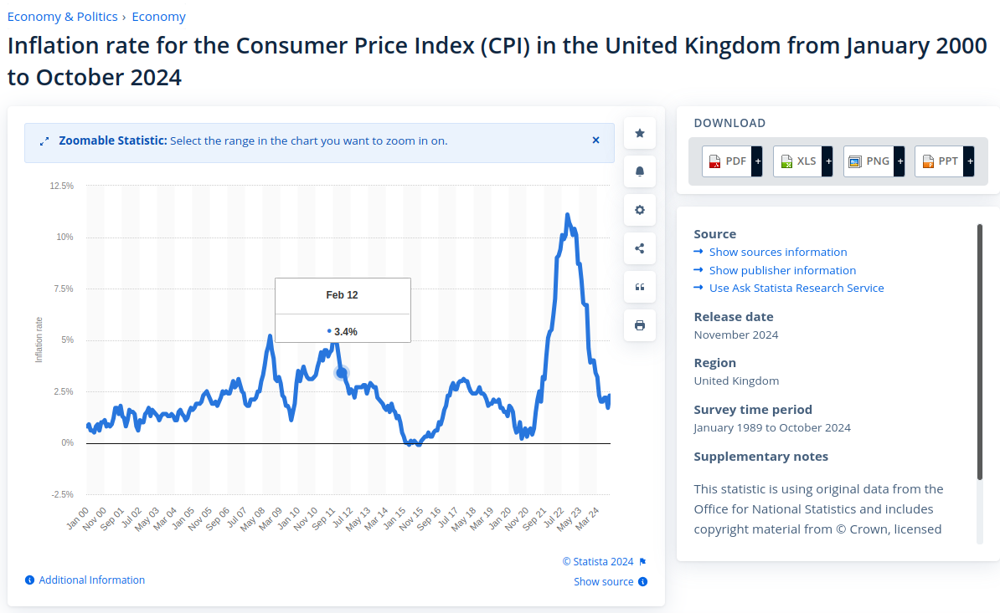 

```python
#Fuente: https://www.statista.com/statistics/306648/inflation-rate-consumer-price-index-cpi-united-kingdom-uk/
data = {
    'Date': ['11-2019', '12-2019', '01-2020', '02-2020', '03-2020', '04-2020', '05-2020', 
                '06-2020', '07-2020', '08-2020', '09-2020', '10-2020', '11-2020'],
    'inflation': [1.3, 1.3, 1.8, 1.7, 1.5, 0.8, 0.5, 0.6, 1.0, 0.2, 0.5, 0.7, 0.7] 
    }

# DataFrame original con datos diarios
data_inflation = pd.DataFrame(data)

# Convertir la columna 'Date' a tipo datetime con formato mensual
data_inflation['Date'] = pd.to_datetime(data_inflation['Date'], format='%m-%Y')

# Crear un rango de fechas que abarque el mes correspondiente para cada fila
data_inflation = data_inflation.set_index('Date').resample('D').ffill().reset_index()

# Renombrar columna a 'Inflation (%)'
data_inflation.rename(columns={'index': 'Date'}, inplace=True)
data_inflation['Date'] = data_inflation['Date'].dt.date

# Unir ambos DataFrames por la columna de fecha
df_jo = pd.merge(df_jo, data_inflation, left_on='created_at_d', right_on='Date', how='left')

```

> Caso donde dado el formato gráfico de la web y que requiere registro para descargar los datos,  es más fácil obtener los datos a mano e incorporarlos directamente en el dataframe


### Indice de desempleo en UK

https://www.ons.gov.uk/employmentandlabourmarket/peoplenotinwork/unemployment/timeseries/mgsx/lms

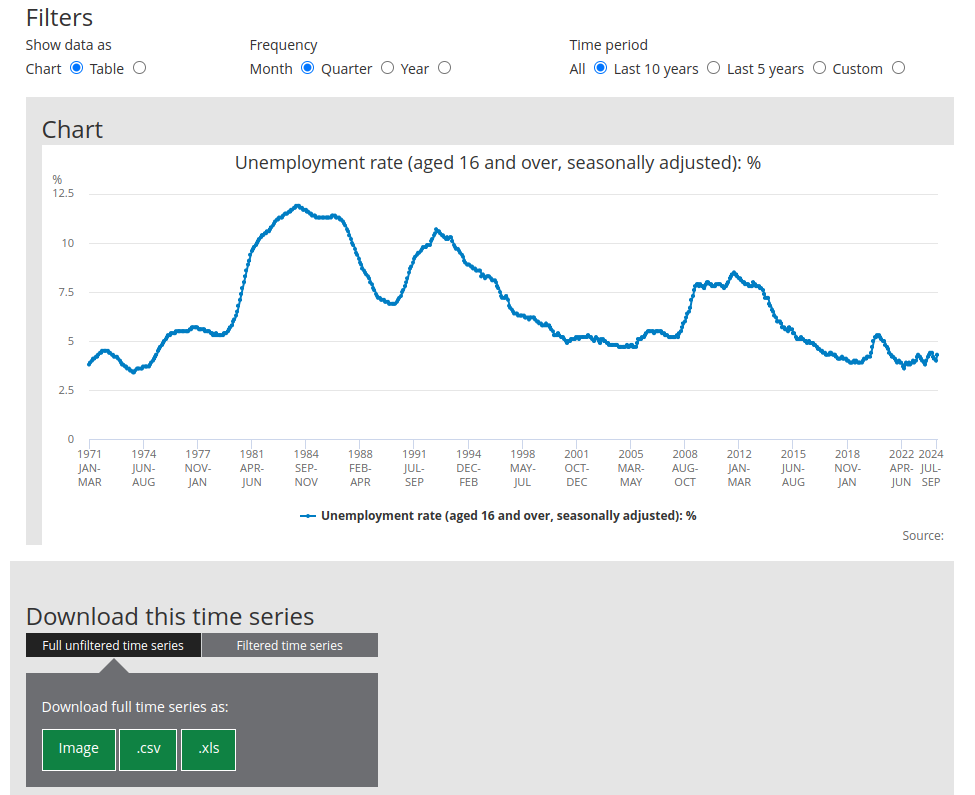 

```python
# #Fuente csv: https://www.ons.gov.uk/employmentandlabourmarket/peoplenotinwork/unemployment/timeseries/mgsx/lms
df_employ["Date"] = pd.to_datetime(df_employ["Title"], format="%Y %b", errors="coerce")
df_employ = df_employ[df_employ["Date"].notna()]
df_employ = df_employ.drop(columns=['Title'])
df_employ = df_employ.rename(columns={'Unemployment rate (aged 16 and over, seasonally adjusted): %': 'unemploy_rate'})
df_employ = df_employ.drop_duplicates('Date')
df_employ['Date'] = pd.to_datetime(df_employ['Date'], format='%m-%Y')
df_employ = df_employ.set_index('Date').resample('D').ffill().reset_index()
df_employ['Date'] = df_employ['Date'].dt.date
cls.add_df(df_employ,"employ")

# Unir ambos DataFrames por la columna de fecha
df_jo = pd.merge(df_jo, df_employ, left_on='created_at_d', right_on='Date', how='left')
        
```

> Caso donde podemos descargar un .csv directamente, solo debemos manipular el formato de los datos importados.


### Valor de cambio divisa EUR-GBP

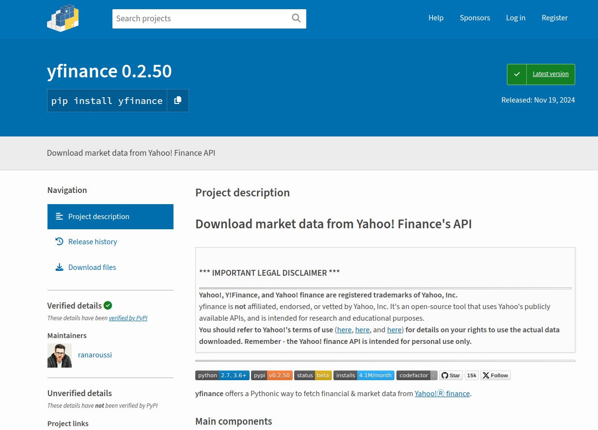 

```python
def fetch_and_prepare_data(ticker, column_name):
    """Descarga datos históricos de un ticker y los prepara con columnas específicas."""
    data = yf.download(ticker, start=date_start, end=date_end)[['Close']].reset_index()
    data.columns = ['Date', column_name]
    data['Date'] = pd.to_datetime(data['Date']).dt.date
    return data

# Descargar y preparar datos
exchange_rate = fetch_and_prepare_data('GBPEUR=X', 'GBP to EUR')
btc_gbp_data = fetch_and_prepare_data('BTC-GBP', 'BTC to GBP')

# Crear un DataFrame con todas las fechas del rango
daily = pd.DataFrame({'Date': pd.date_range(start=date_start, end=date_end, freq='D').date})

# Unir datos y llenar valores faltantes con 0
divisa_exogenas = daily.merge(exchange_rate, on='Date', how='left').fillna(0)
divisa_exogenas = divisa_exogenas.merge(btc_gbp_data, on='Date', how='left').fillna(0)

```

> Usar la API que ofrece la web para descargar directamente los datos, en este caso, el cambio de libras: GBP to EUR y el de Bitcoin: BTC to GBP
>
> En la implementación completa, guardamos los datos obtenidos en local para no repetir la descarga en sucesivas ejecuciones del código, salvo que le indiquemos a la librería que reinicie la información almacenada. 


### Estudio de registros de status

#### Cash_Request (CR)


```python
counts = cr_cp.status.value_counts()
display(counts)

counts = cr_cp.transfer_type.value_counts()
display(counts)

counts = cr_cp.recovery_status.value_counts()
display(counts)

counts = cr_cp.money_back_date.value_counts()
display(counts)
```

##### CR.Status (23970 registros)

- **money_back**: 16397 registros. El CR fue reembolsado exitosamente.
- **rejected**: 6568 registros. El CR necesitó una revisión manual y fue rechazado.
- **direct_debit_rejected**: 831 registros. El intento de débito directo SEPA falló.
- **active**: 59 registros. Los fondos fueron recibidos en la cuenta del cliente.
- **transaction_declined**: 48 registros. No se pudo enviar el dinero al cliente.
- **canceled**: 33 registros. El usuario no confirmó el CR en la app, fue cancelado automáticamente.
- **direct_debit_sent**: 34 registros. Se envió un débito directo SEPA, pero aún no se confirma el resultado.


    status
    money_back               16395
    rejected                  6568
    direct_debit_rejected      831
    active                      59
    transaction_declined        48
    direct_debit_sent           34
    canceled                    33
    Name: count, dtype: int64

#### Tras el merge:

| CR Status             | Regs(join y limpiar) |
| --------------------- | :------------------- |
| money_back            | 23268                |
| rejected              | 6568                 |
| direct_debit_rejected | 1941                 |
| active                | 158                  |
| direct_debit_sent     | 74                   |
| transaction_declined  | 48                   |
| canceled              | 35                   |


    money_back_date
    2020-08-04 22:00:00.000000    364
    2020-08-05 22:00:00.000000    295
    2020-07-29 22:00:00.000000    244
    2020-07-07 22:00:00.000000    180
    2020-09-01 22:00:00.000000    134
                                 ... 
    2020-10-14 19:53:17.175800      1
    2020-11-06 20:27:59.808825      1
    2020-11-12 17:56:26.237355      1
    2020-09-09 19:50:00.196742      1
    2020-09-04 19:34:10.516739      1
    Name: count, Length: 12265, dtype: int64

.

##### CR.Transfer Type

- **instant**: El usuario eligió recibir el adelanto instantáneamente.
- **regular**: El usuario eligió no pagar inmediatamente y esperar la transferencia.

    transfer_type
    instant    13882
    regular    10086
    Name: count, dtype: int64

#### Tras el merge:

| transfer_type | regs(join y limpiar) |
| ------------- | :------------------- |
| instant       | 19488                |
| regular       | 12604                |


##### CR.Recovery Status

- **null**: El CR nunca tuvo un incidente de pago.
- **completed**: El incidente de pago fue resuelto (el CR fue reembolsado).
- **pending**: El incidente de pago aún está abierto.
- **pending_direct_debit**: El incidente de pago sigue abierto, pero se ha lanzado un débito directo SEPA.

    recovery_status
    nice                    20639
    completed                2467
    pending                   845
    pending_direct_debit       16
    cancelled                   1
    Name: count, dtype: int64

#### Tras el merge:

| recovery_status      | regs(join y limpiar) |
| -------------------- | :------------------- |
| nice (null)          | 24893                |
| completed            | 5166                 |
| pending              | 1996                 |
| pending_direct_debit | 36                   |
| cancelled            | 1                    |


#### Fees (FE)

```python
counts = fe_cp.status.value_counts()
display(counts)

counts = fe_cp.type.value_counts()
display(counts)

counts = fe_cp.category.value_counts()
display(counts)

counts = fe_cp.charge_moment.value_counts()
display(counts)
```

##### FE.Type

- **instant_payment**: Fees por adelanto instantáneo.
- **split_payment**: Fees por pago fraccionado (en caso de un incidente).
- **incident**: Fees por fallos de reembolsos.
- **postpone**: Fees por la solicitud de posponer un reembolso.

    type
    instant_payment    11095
    postpone            7766
    incident            2196
    Name: count, dtype: int64

#### Tras el merge:

| type            | regs(join y limpiar) |
| --------------- | :------------------- |
| instant_payment | 11095                |
| nice  (null)    | 11037                |
| postpone        | 7765                 |
| incident        | 2195                 |

##### FE.Status

- **confirmed**: El usuario completó una acción que creó un fee.
- **rejected**: El último intento de cobrar el fee falló.
- **cancelled**: El fee fue creado pero cancelado por algún motivo.
- **accepted**: El fee fue cobrado exitosamente.


    status
    accepted     14841
    cancelled     4934
    rejected      1194
    confirmed       88
    Name: count, dtype: int64

#### Tras el merge:

| stat_fe   | regs(join y limpiar) |
| --------- | :------------------- |
| accepted  | 14839                |
| cancelled | 4934                 |
| rejected  | 1194                 |
| confirmed | 88                   |

##### FE.Category

- **rejected_direct_debit**: Fees creados cuando el banco del usuario rechaza el primer débito directo.
- **month_delay_on_payment**: Fees creados cada mes hasta que el incidente se cierre.
- **null**: No figura en la documentación

    category
    nice                      18861
    rejected_direct_debit      1599
    month_delay_on_payment      597
    Name: count, dtype: int64

#### Tras el merge:

| category               | regs(join y limpiar) |
| ---------------------- | :------------------- |
| nice  (null)           | 18860                |
| rejected_direct_debit  | 1598                 |
| month_delay_on_payment | 597                  |

##### FE.Charge Moment

- **before**: El fee se cobra en el momento de su creación.
- **after**: El fee se cobra cuando el CR es reembolsado.

    charge_moment
    after     16720
    before     4337
    Name: count, dtype: int64

#### Tras el merge:

| charge_moment | Regs(join y limpiar) |
| ------------- | :------------------- |
| after         | 16719                |
| before        | 4336                 |


### Análisis de Series Temporales y Ruido asociado

>  [!NOTE]
>
>  (1) **Análisis de Series de Tiempo**: Realizar un análisis exhaustivo de las tendencias y patrones temporales presentes en los datos.


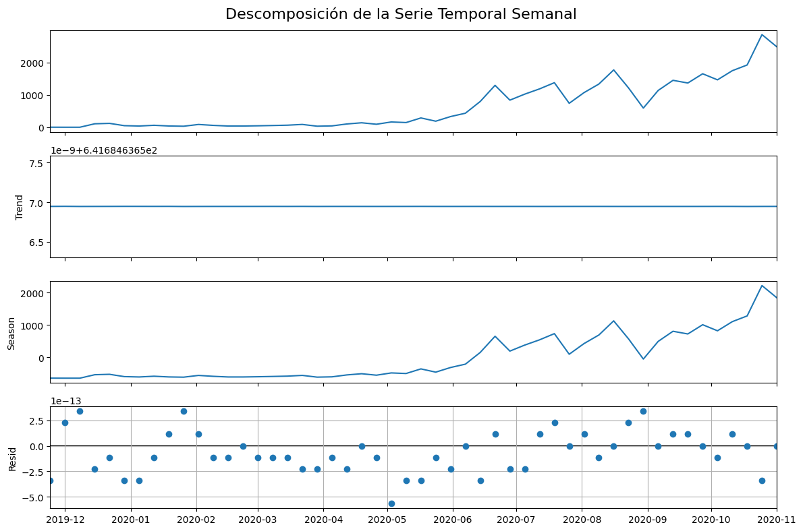
    

> Se aprecia un aspecto incremental de los datos al ver la evolución a lo largo del periodo.


​    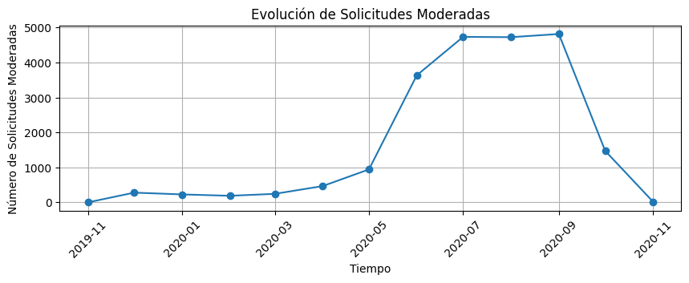
​    


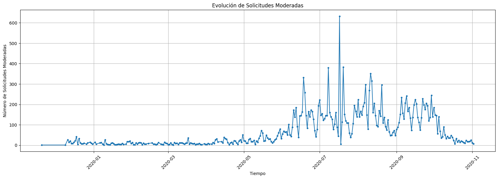
    

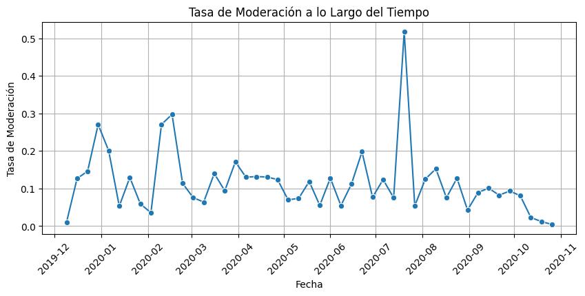
    ..

  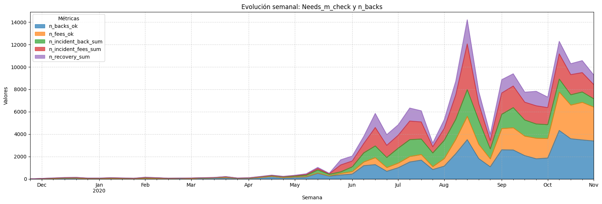
​    ..

​    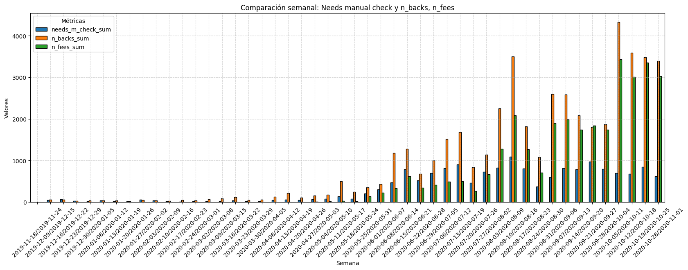
​    


```
# Aqui claramente, estan filtrada las que se han completado correctamente.
```

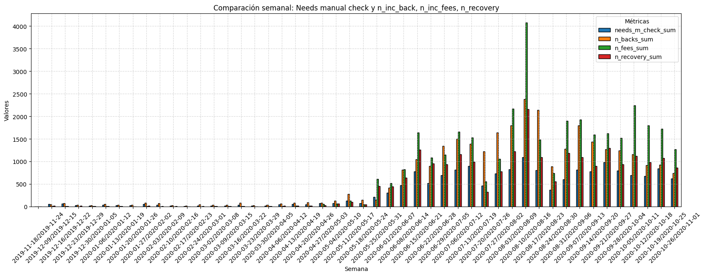


## Análisis Exploratorio de Datos (EDA)

>  [!NOTE] 
>
> (2) **Análisis Exploratorio de Datos (EDA)**: Identificar patrones, anomalías y relaciones entre las variables mediante visualizaciones y estadísticas descriptivas.
>


Utilizamos `info()` para revisar la estructura y los tipos de datos del conjunto.

* * Los detalles concretos con shape, columns o dtypes.
* Explorar datos, fechas, nulos, columnas innecesarias
* Discusión sobre qué hacer con los datos de fechas que faltan (interpolcio o medias)

##### Mostrar la estructura de datos del dataset

    Dataset ./data/extract - cash request - data analyst.csv cargado correctamente.
    Dimensiones del dataset cr: (23970, 16)
    Columnas: ['id', 'amount', 'status', 'created_at', 'updated_at', 'user_id', 'moderated_at', 'deleted_account_id', 'reimbursement_date', 'cash_request_received_date', 'money_back_date', 'transfer_type', 'send_at', 'recovery_status', 'reco_creation', 'reco_last_update']
    Dataset ./data/extract - fees - data analyst - .csv cargado correctamente.
    Dimensiones del dataset fe: (21061, 13)
    Columnas: ['id', 'cash_request_id', 'type', 'status', 'category', 'total_amount', 'reason', 'created_at', 'updated_at', 'paid_at', 'from_date', 'to_date', 'charge_moment']
    <class 'pandas.core.frame.DataFrame'>
    RangeIndex: 32092 entries, 0 to 32091
    Data columns (total 56 columns):
     #   Column                      Non-Null Count  Dtype          
    ---  ------                      --------------  -----          
     0   id_cr                       32092 non-null  int64          
     1   id_fe                       32092 non-null  int64          
     2   fe_cr_id                    21055 non-null  float64        
     3   user_id                     32092 non-null  int64          
     4   active                      32092 non-null  int64          
     5   created_at                  32092 non-null  datetime64[ns] 
     6   created_at_fe               21055 non-null  datetime64[ns] 
     7   amount                      32092 non-null  float64        
     8   fee                         32092 non-null  float64        
     9   stat_cr                     32092 non-null  object         
     10  stat_fe                     32092 non-null  object         
     11  transfer_type               32092 non-null  object         
     12  type                        32092 non-null  object         
     13  to_receive_ini              25366 non-null  timedelta64[ns]
     14  to_receive_bank             18691 non-null  timedelta64[ns]
     15  to_reimbur                  32092 non-null  timedelta64[ns]
     16  to_reimbur_cash             22677 non-null  timedelta64[ns]
     17  to_end                      24106 non-null  timedelta64[ns]
     18  to_send                     22677 non-null  timedelta64[ns]
     19  send_at                     22677 non-null  datetime64[ns] 
     20  cr_received_date            25366 non-null  datetime64[ns] 
     21  money_back_date             24106 non-null  datetime64[ns] 
     22  reimbursement_date          32092 non-null  datetime64[ns] 
     23  paid_at                     15529 non-null  datetime64[ns] 
     24  charge_moment               21055 non-null  object         
     25  moderated_at                21757 non-null  datetime64[ns] 
     26  reason                      21055 non-null  object         
     27  category                    21055 non-null  object         
     28  from_date                   7765 non-null   datetime64[ns] 
     29  to_date                     7765 non-null   datetime64[ns] 
     30  recovery_status             32092 non-null  object         
     31  updated_at                  32092 non-null  datetime64[ns] 
     32  reco_creation               7199 non-null   datetime64[ns] 
     33  reco_last_update            7199 non-null   datetime64[ns] 
     34  updated_at_fe               21055 non-null  datetime64[ns] 
     35  Mes_created_at              32092 non-null  period[M]      
     36  cash_request_received_date  25366 non-null  datetime64[ns] 
     37  created_at_slot             32092 non-null  int32          
     38  created_at_dow              32092 non-null  int32          
     39  needs_m_check_recov         32092 non-null  int64          
     40  n_fees                      32092 non-null  int64          
     41  n_backs                     32092 non-null  int64          
     42  n_inc_back                  32092 non-null  int64          
     43  n_inc_fees                  32092 non-null  int64          
     44  n_recovery                  32092 non-null  int64          
     45  created_at_w                32092 non-null  UInt32         
     46  n_cr_fe_w                   32092 non-null  int64          
     47  created_at_m                32092 non-null  int32          
     48  n_cr_fe_m                   32092 non-null  int64          
     49  created_at_y                32092 non-null  int32          
     50  n_cr_fe_y                   32092 non-null  int64          
     51  created_at_d                32092 non-null  object         
     52  GBP_EUR                     32092 non-null  float64        
     53  BTC_GBP                     32092 non-null  float64        
     54  inflation                   32092 non-null  float64        
     55  unemploy_rate               32092 non-null  object         
    dtypes: UInt32(1), datetime64[ns](15), float64(6), int32(4), int64(13), object(10), period[M](1), timedelta64[ns](6)
    memory usage: 13.1+ MB


### Forma del DataFrame Cash Request (filas, columnas): (23968, 23)


    Nombres de Columnas: Index(['id', 'amount', 'status', 'created_at', 'updated_at', 'user_id',
           'moderated_at', 'deleted_account_id', 'reimbursement_date',
           'cash_request_received_date', 'money_back_date', 'transfer_type',
           'send_at', 'recovery_status', 'reco_creation', 'reco_last_update',
           'Mes_created_at', 'to_receive_ini', 'to_receive_bank', 'to_reimbur',
           'to_reimbur_cash', 'to_end', 'to_send'],
          dtype='object')
    
    Tipos de datos de cada columna:
    id                                      int64
    amount                                float64
    status                                 object
    created_at                     datetime64[ns]
    updated_at                     datetime64[ns]
    user_id                                 int64
    moderated_at                   datetime64[ns]
    deleted_account_id                    float64
    reimbursement_date             datetime64[ns]
    cash_request_received_date     datetime64[ns]
    money_back_date                datetime64[ns]
    transfer_type                          object
    send_at                        datetime64[ns]
    recovery_status                        object
    reco_creation                  datetime64[ns]
    reco_last_update               datetime64[ns]
    Mes_created_at                      period[M]
    to_receive_ini                timedelta64[ns]
    to_receive_bank               timedelta64[ns]
    to_reimbur                    timedelta64[ns]
    to_reimbur_cash               timedelta64[ns]
    to_end                        timedelta64[ns]
    to_send                       timedelta64[ns]
    dtype: object


### Forma del DataFrame Fees (filas, columnas): (21057, 13)


    Nombres de Columnas: Index(['id', 'cash_request_id', 'type', 'status', 'category', 'total_amount',
           'reason', 'created_at', 'updated_at', 'paid_at', 'from_date', 'to_date',
           'charge_moment'],
          dtype='object')
    
    Tipos de datos de cada columna:
    id                          int64
    cash_request_id             int64
    type                       object
    status                     object
    category                   object
    total_amount              float64
    reason                     object
    created_at         datetime64[ns]
    updated_at         datetime64[ns]
    paid_at            datetime64[ns]
    from_date          datetime64[ns]
    to_date            datetime64[ns]
    charge_moment              object
    dtype: object


### Elaboración de nuevas columnas 

A medida que hemos ido analizando los datos, se ha determinado que debemos crear una serie de columnas para poder identificar los usuarios (`user_id`) que deberían ser moderados:

#### 1. `needs_m_check_recov`

```python
df['needs_m_check_recov'] = ~(is_good_cr & is_good_fe & recovery_status_nice)
```

- Indica si un usuario tiene un historial donde si crédito o feed no ha sido consistente o ha tenido problemas en recuperación (estado distinto a `'nice'`).

- La usamos para Identifica usuarios con historial problemático, que podrían tener mayor riesgo de incumplir con nuevos créditos. Estos son **los que consideramos, deberían ser moderados**.

  

#### Respecto a los ingresos

#### 2. `n_backs`

```python
unique_cr = money_back & (df['amount'] > 0) & ~df.duplicated(subset=['id_cr'], keep='first')
df['n_backs'] = unique_cr.groupby(df['user_id']).cumsum()
```

- Indica el número acumulado de transacciones únicas con estado `money_back` e importe positivo.
- El objetivo es identificar en el cliente un historial elevado de devoluciones, que podría indicar problemas recurrentes con pagos o acuerdos previos, aumentando el riesgo de futuros incumplimientos.

#### 3. `n_fees`

```python
df['n_fees'] = money_back & fee_accepted & (df['fee'] > 0)
df['n_fees'] = df.groupby('user_id')['n_fees'].cumsum()
```

- Indica el número acumulado de transacciones donde  el crédito tiene estado `money_back`,  la feed fue aceptada (`fee_accepted`) y se aplicó un cobro (`fee > 0`).
- Nos permite identifica usuarios con un historial de múltiples devoluciones de prestamos asociadas a feeds aceptadas. Esto puede reflejar un comportamiento recurrente relacionado con la estabilidad en prestamos futuros.

#### Respecto a la incidencias

#### 4. `n_inc_back`

```python
df['n_inc_back'] = ~is_good_cr
df['n_inc_back'] = df.groupby('user_id')['n_inc_back'].cumsum()
```

- Indica el número acumulado de créditos con estados "malos" (no están en `good_cr`).
- Refleja un historial de créditos irregular o problemático, lo que puede ser un indicador de riesgo para nuevos créditos.

------

#### 5. `n_inc_fees`

```python
df['n_inc_fees'] = (~is_good_fe | bad_recovery_status_fe)
df['n_inc_fees'] = df.groupby('user_id')['n_inc_fees'].cumsum()
```

- Indica el número acumulado de feeds "malos" o problemas en la devolución.
- Nos ayuda a detectar problemas históricos en los feeds y estados de recuperación. Estos pueden influir en la probabilidad de que el usuario tenga dificultades en nuevos futuros.

#### 6. `n_recovery`

```python
df['n_recovery'] = ~recovery_status_nice
df['n_recovery'] = df.groupby('user_id')['n_recovery'].cumsum()
```

- Indica el número acumulado de incidencias en recuperación (estados distintos a `'nice'`).
- Consideramos que un alto número de incidencias en recuperación es un buen indicador de usuarios con un historial financiero inestable, lo que podría traducirse en mayor riesgo.

#### 7. `n_cr_fe_w`

- Indica la frecuencia semanal de combinaciones de Cash Request y feeds por usuario.
- Ayuda a  identificar usuarios que tienen un historial de alta frecuencia en solicitudes o transacciones. Aunque no necesariamente es un problema, frecuencias excesivamente altas pueden ser una señal de usuarios dependientes de créditos, lo que podría implicar mayor riesgo.

#### 8. `created_at_slot`

```python
df['created_at_slot'] = df['created_at'].dt.hour
```

- La hora en la que se realizó la acción (por ejemplo, solicitud o pago).
- Algunos usuarios problemáticos podrían mostrar patrones temporales específicos, como operar fuera de horarios comerciales. Este dato puede servir para identificar correlaciones entre la hora de actividad y el comportamiento futuro.

------

#### 9. `created_at_dow`

```python
df['created_at_dow'] = df['created_at'].dt.dayofweek
```

- El día de la semana en que se realizó la acción (lunes a domingo).
- Similar a `created_at_slot`, nos ayuda a analizar si hay patrones semanales de usuarios que tienden a ser problemáticos (por ejemplo, solicitudes recurrentes en fines de semana podrían correlacionarse con menor estabilidad en pagos).


## Análisis de Calidad de los Datos

>  [!NOTE]
>
>  (3) **Análisis de Calidad de los Datos**: Evaluar la calidad de los datos, identificando problemas como valores faltantes, inconsistencias, errores o duplicados.

### Limpieza de la base de datos


```python
# filtros = ~df['cash_request_id'].isin(df['id_cr']) & df['cash_request_id'].notna()
# # Crear un nuevo DataFrame con los registros filtrados
# df_faltantes = df[filtros]
# # Mostrar los resultados
# print("Registros donde cash_request_id no existe en id_cr:")
# display(df_faltantes[['id_cr','cash_request_id','id_fe']])


# Filtrar valores no NaN en cash_request_id
#df_filtered = df[df['cash_request_id'].notna()]
#display(df_filtered[['id_cr','cash_request_id','id_fe']])

# # Filtrar registros donde cash_request_id no existe en id_cr
# df_missing = df_filtered[~df_filtered['cash_request_id'].isin(df['id_cr'])]

# # Mostrar los resultados
# print("Registros donde cash_request_id no existe en id_cr:")
# display(df_missing)
```


```python
# Incoroprado en la libreria: Eliminar los Fees que apuntan cr_id inexistentes.

df_cr = pm.df('cr_cp')
df_fe = pm.df('fe_cp')
#df.info()

# Filtrar los registros donde cash_request_id no está en id_cr
# 21057
filtros = df_fe['cash_request_id'].isin(df_cr['id']) 
#display(filtros)


# Crear un nuevo DataFrame con los registros filtrados
df_faltantes = df_fe[filtros]

# Mostrar los resultados
print("Registros donde cash_request_id no existe en id_cr:")
display(df_faltantes)

```


#### Casos de registros erroneos en los datos de origen


    stat_cr
    money_back               23268
    rejected                  6568
    direct_debit_rejected     1941
    active                     158
    direct_debit_sent           74
    transaction_declined        48
    canceled                    35
    Name: count, dtype: int64


    transfer_type
    instant    19488
    regular    12604
    Name: count, dtype: int64


    recovery_status
    nice                    24893
    completed                5166
    pending                  1996
    pending_direct_debit       36
    cancelled                   1
    Name: count, dtype: int64


    type
    instant_payment    11095
    0                  11037
    postpone            7765
    incident            2195
    Name: count, dtype: int64


    stat_fe
    accepted      14839
    cr_regular    11037
    cancelled      4934
    rejected       1194
    confirmed        88
    Name: count, dtype: int64


    category
    nice                      18860
    rejected_direct_debit      1598
    month_delay_on_payment      597
    Name: count, dtype: int64


    category
    nice                      18860
    rejected_direct_debit      1598
    month_delay_on_payment      597
    Name: count, dtype: int64


    charge_moment
    after     16719
    before     4336
    Name: count, dtype: int64


#### Casos que no son outlayers, son errores:


```python
errors = df_jo[(df_jo['created_at']> df_jo['money_back_date']) | 
               (df_jo['created_at'] > df_jo['reimbursement_date'])]
# errors = df_jo[df_jo['created_at'].dt.date > df_jo['cash_request_received_date'].dt.date ]
# errors = df_jo[df_jo['created_at'].dt.date > df_jo['moderated_at'].dt.date]
#errors = df_jo[df_jo['to_send'].dt.total_seconds() < 0]

# Aquest no es un problema
# errors = df_jo[df_jo['to_end'].dt.total_seconds() < 0]
display(errors)
      
# Tiempo que la empresa recupera el dinero desde la primera accion.
cr_cp['to_reimbur'] = cr_cp.reimbursement_date-cr_cp.created_at

# Tiempo en el que la emprera realmente ha prestado el dinero
cr_cp['to_reimbur_cash'] = cr_cp.reimbursement_date-cr_cp.send_at

# Tiempo que la empresa presta el dinero.
cr_cp['to_end'] = cr_cp.reimbursement_date-cr_cp.money_back_date

# Tiempo que tarda en recibir el dinero el usuario desde la primera accion.
# cr_received_date  (cash_request_received_date) = ??
cr_cp['to_receive_ini'] = cr_cp.cash_request_received_date-cr_cp.created_at

# Tiempo que tarda en recibir el dinero el usuario desde que se envia (demora entre bancos).
cr_cp['to_receive_bank'] = cr_cp.cash_request_received_date-cr_cp.send_at

# En funcion del tipo instant o regular:
# TransfType: instant send_at - created_at =? 0 dias
# TransfType: regular send_at - created_at =? 7 dias
cr_cp['to_send'] = cr_cp.send_at-cr_cp.created_at
```


## ANÁLISIS

>  [!NOTE]  
>
> (4) **Análisis Gráfico de los Datos**: Representar gráficamente las variables mediante gráficos como histogramas, diagramas de dispersión, boxplots, entre otros, para facilitar la comprensión visual de los datos.

### Visión global de datos


​    
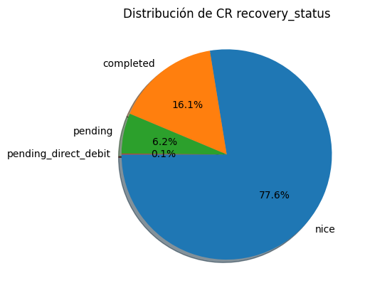
​    


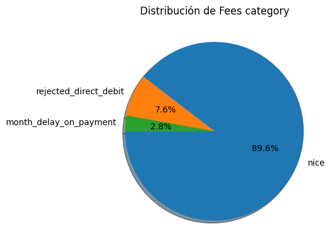
    

----


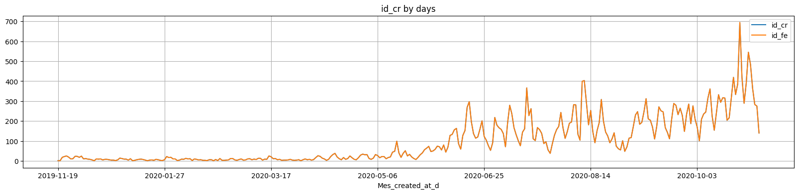
    

---


### Gráficos para Visualización de Datos

#### Evolución de la base de usuarios

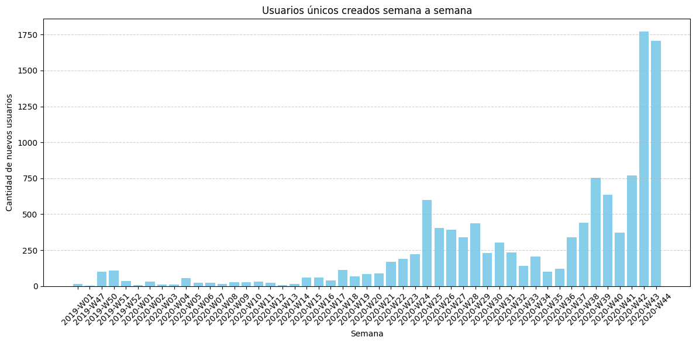
​    

#### Usuarios eliminados

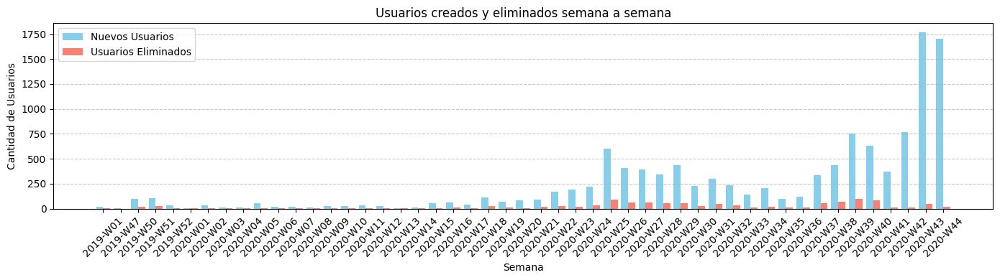
​    


    Total activos: 11938
    Total eliminados: 1141

```
user_id
16391     37
15593     29
3045      28
23823     25
17144     25
          ..
103496     1
64005      1
103421     1
102737     1
897        1
Name: count, Length: 11938, dtype: int64
```


### Estudio de casos de clientes concretos (user_id):

Nos ha resultado muy útil consultar los datos con un pequeño bloque de código en vez de recurrir constantemente a una hoja de calculo.

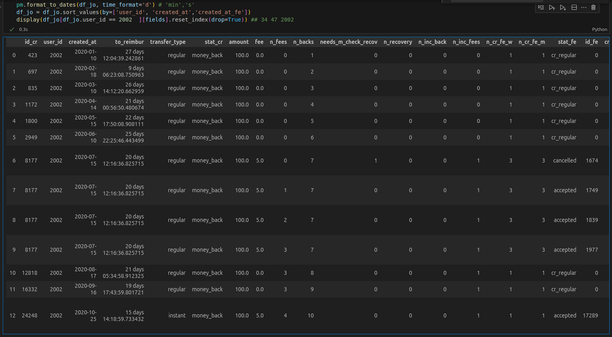

> Lista de clientes con los que hemos examinando los detalles.  (podemos mostrar o examinar casos específicos). 

Clientes que identificamos como "Vips" al examinar en detalle su cantidad de prestamos:

* 90 Este parece que se esté gestionando mal: todos instant, con demoras y sin gestión aparente ?.

* 1946 Parece un ejemplo de buena gestión, al final tiene un instant y se le ha dado margen en las demoras.

* 1987 Parece un ejemplo de buen usuario, se pasa a instant para siempre.

* Algunos más: 

* 13851 2002  526 12934 12274 54879 12441 13851 16391 430  63894 18730 10116 21465 99000262

* 102105  13851  19655 21465 14631


```python
user_id = 2002# 16391 # 2002, 1987, 13851, 16391, 102105
display(cohort_analysis_2[cohort_analysis_2.user_id == user_id])

#print("Casos segun Cash Request ID")
pd.options.display.max_columns = None
for id in ([-8177]): # 16391 20108, 20104, 20112,
    df_t = df_jo[df_jo['id_cr'] == id].sort_values(['created_at','created_at_fe']).reset_index()
    print(f"Cash Request ID: {id}")
    display(df_t[fields])

user_ids = [user_id] 
pd.options.display.max_columns = None
#print("Casos segun Cash User ID")
for id in (user_ids):
    df_t = df_jo[(df_jo['user_id'] == id)]#.reset_index()
    df_t = df_t[df_t['stat_cr'] == 'money_back']
    df_t = df_t[df_t['stat_fe'] == 'accepted']
    
    df_t = df_t.sort_values(['created_at','created_at_fe']).reset_index(drop=True)
    #df_t.set_index('id_cr', inplace=True)
    print(f"Only money_back - user_id {id}")
    display(df_t[fields])
    df_t = df_jo[(df_jo['user_id'] == id) ].sort_values(['created_at','created_at_fe']).reset_index(drop=True)

    print(f"user_id {id}")
    display(df_t[fields])
```


### Estudio de top FEES  


| **user_id** | **fees** |
| :---------: | :------- |
|    17144    | 75.0     |
|    12934    | 55.0     |
|    13404    | 35.0     |
|    6219     | 35.0     |
|    17603    | 35.0     |
|    8944     | 35.0     |
|  99021532   | 35.0     |
|    1987     | 35.0     |
|    9199     | 35.0     |
|    23164    | 35.0     |


---


### Exploración de la temporalidad:

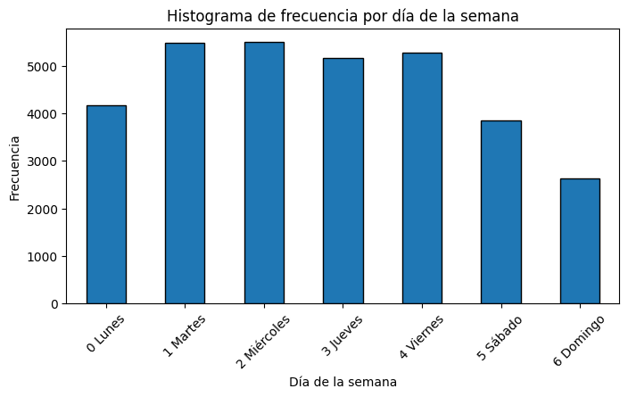
    

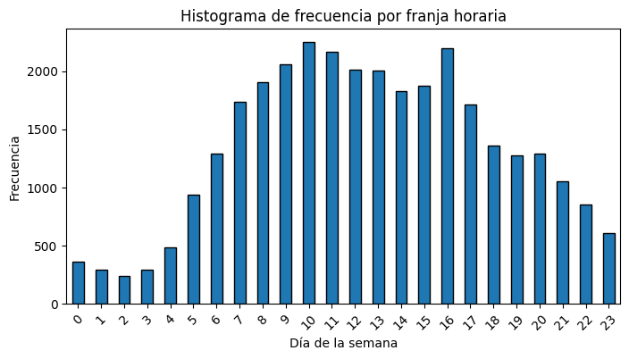
    

#### Calcular la medias:

* 2,94 dias de demora promedio en las transferencias bancarias
* 31.6: Promedio del tiempo que tarda la empresa en cobrar los fee


```python
pd.options.display.max_columns = None
df = pm.df('df_jo')
# Calcular la medias:

# 2,94 dias de demora promedio en las transferencias bancarias
print(df['to_receive_bank'].dt.days.mean())
#x = df['to_b2b_delay'] = (df.cr_received_date-df.send_at).dt.days
#display(x.notna().mean())
#display(df['to_b2b_delay'])# .mean()

# 31.6: Promedio del tiempo que tarda la empresa en cobrar los fee
df['to_fee_paid_delay'] = (df.paid_at -df.created_at).dt.days
x =  df[(df['to_fee_paid_delay'].notna()) & (df['stat_cr'] == 'money_back')]
display(x.to_fee_paid_delay.mean())

```

    -2.5572200524316515
    
    np.float64(31.65246496060247)


#### Identificar datos erróneos en la base de datos:


```python
pd.options.display.max_columns = None
df = pm.df('df_jo')

# send_at mirar si tiene registros faltantes.
# money_back_date

#0 registros
#display(df[ (df['reimbursement_date'].isna()) & (df['stat_cr'] == 'money_back') ])


#191 registros
#display(df[ ((df['reimbursement_date'].isna()) | (df['money_back_date'].isna())) & (df['stat_cr'] == 'money_back') ])

#191 Normalizamos:
display(df[ (df['money_back_date'].isna()) & (df['stat_cr'] == 'money_back') ])
df['money_back_date'] = df.apply(
            lambda row: row['reimbursement_date']             
            if ( pd.isna(row['money_back_date']) & (row['stat_cr'] == 'money_back') ) 
            else row['money_back_date'], axis=1)
display(df[ (df['money_back_date'].isna()) & (df['stat_cr'] == 'money_back') ])

# 838  registros
#display(df[ (df['reimbursement_date'].notna()) & (df['money_back_date'].notna() & (df['stat_cr'] != 'money_back') )])#.head(5).reset_index()
```

> Caso singular donde solo figura en la base de datos money_back - user_id 2002


```python
pd.options.display.max_columns = None
df = pm.df('df_jo')

# cr_received_date a 'send_at' +3 dias
display(df[ (df['send_at'].notna()) & (df['cr_received_date'].isna() & (df['stat_cr'] == 'money_back') )])#.head(5).reset_index()
df['cr_received_date'] = df.apply(
            lambda row: row['send_at']+ pd.DateOffset(days=3) 
            if ( pd.isna(row['cr_received_date']) & (row['stat_cr'] == 'money_back') ) 
            else row['cr_received_date'], axis=1
        )
display(df[ (df['send_at'].notna()) & (df['cr_received_date'].isna() & (df['stat_cr'] == 'money_back') )])#.head(5).reset_index()
```

> Normalizamos 1219 registros. Los actualizamos a +3 dias (promedio 2,94 dias)


```python
#display(df[ (df['send_at'].isna()) & (df['cr_received_date'].notna() & (df['stat_cr'] == 'money_back') )])#.head(5).reset_index()

# 8177 Casos
#display(df[ (df['reimbursement_date'].isna()) | (df['money_back_date'].isna())  ])#.head(5).reset_index()
```

> 5960 registros. Los actualizamos a -3 dias (promedio 2,94 dias)


## Segmentación

>  [!NOTE]
>
> (5) **Segmentación Inteligente de los Datos**: Implementar técnicas de segmentación avanzadas que aporten valor al análisis y la extracción de insights relevantes.

### Clientes respecto a han sido moderados

    Usuarios nuevos: 5027
    moderados: 21757
    no moderados: 10335

### Histogramas


        
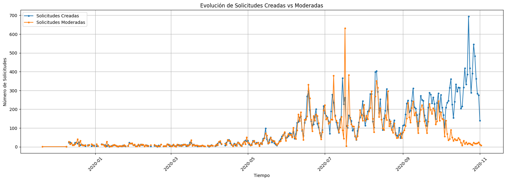

```python
## Ejemplo para user_id 47
display(df[df['user_id'] == 47].sort_values('created_at')[fields].reset_index())
```


### Detalle clientes por frecuencia en operaciones exitosas

#### Por ID de Cash Request


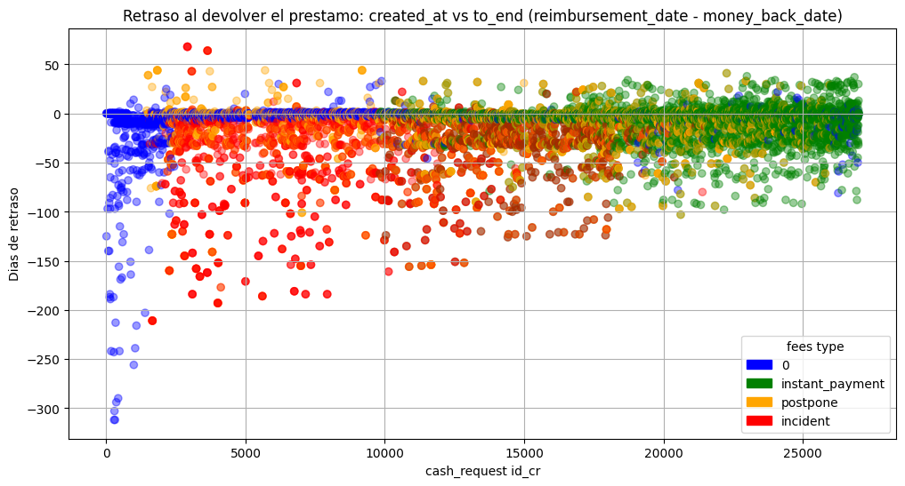
    


#### Por fecha creacion de registro de Cash Request


​    
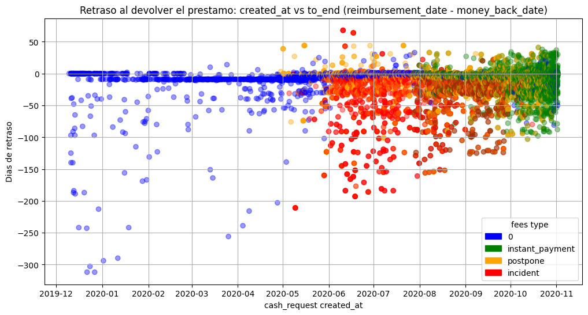
​    


#### Por fecha creacion de registro de Cash Request (Escala logaritmica)


​    
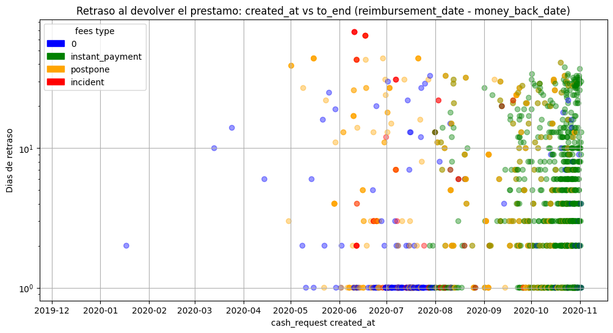
​    


​    
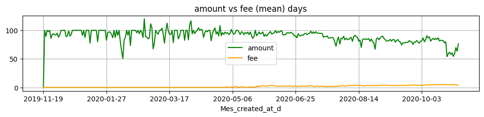
​    


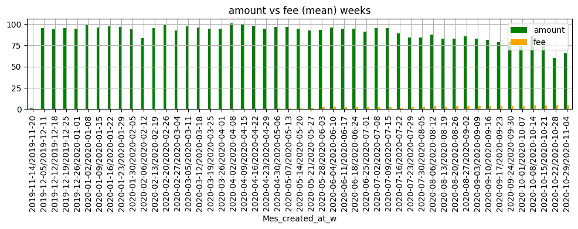
    


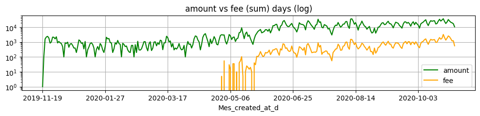
    


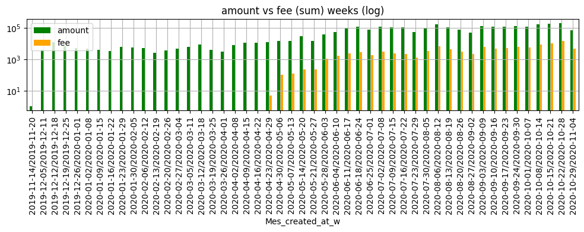
    


#### Importes de los prestamos


​    
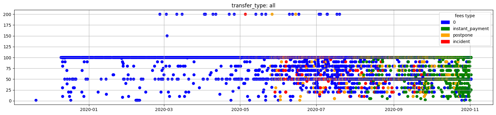
​    


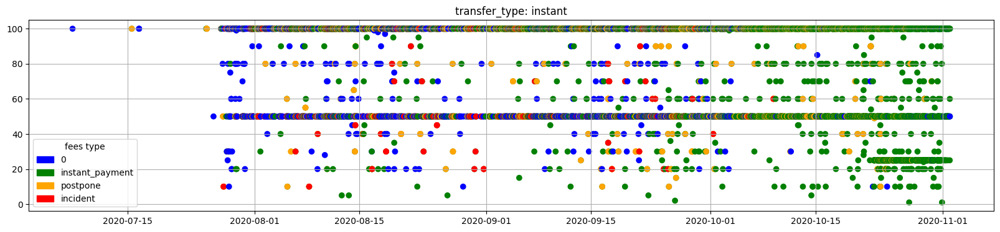
    


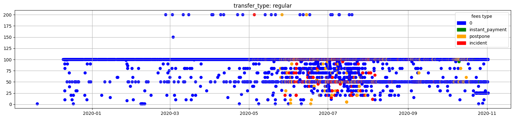
    


### Mapas de calor: Cash Request join Fees


```python
#cash_request=pd.read_csv('../data/extract - cash request - data analyst.csv')
#fees=pd.read_csv('../data/extract - fees - data analyst - .csv')
df_jo = pm.df('df_jo')

fig1 = px.imshow(df_jo.isnull(),
color_continuous_scale=['black', 'red'],
labels=dict(color="NaN"),
title="Mapa de calor para cash_request join fees")
fig1.update_layout(width=700, height=700)
fig1.update_coloraxes(showscale=False)
fig1.show()
```


#### Mapa de calor de los registros

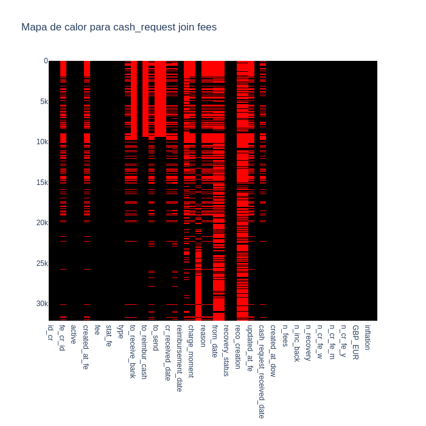 

### Correlaciones

>  [!NOTE]  
>
> (6) **Análisis de Correlación**: Evaluar las relaciones y asociaciones entre las variables mediante matrices de correlación y análisis de dependencias.

##### Correlaciones descartando columnas auxiliares de fechas


```python
df = pm.df('df_hyper')
#df = df.drop(columns=['cash_request_received_date'])

d_list = list(df.select_dtypes(include=['datetime64']).columns)
for date in d_list:
    df[date] = pd.to_datetime(df[date]).dt.strftime('%Y%m%d').astype(float)
df_corr = df.select_dtypes(include=['number'])
matriz_corr = df_corr.corr()
plt.figure(figsize=(12, 12)) 
sns.heatmap(matriz_corr, annot=True, cmap='coolwarm', fmt=".2f", square=True, linewidths=0.5)
plt.title('Matriz de correlación')
plt.show()

# Identificar columnas con correlación alta (umbral = 0.8)
threshold = 0.8
to_drop = []
for column in matriz_corr.columns:
    if any((matriz_corr[column].abs() > threshold) & (matriz_corr.index != column)):
        to_drop.append(column)
print(f"Variables altamente correlacionadas con otras:")
display(to_drop)
```


​    
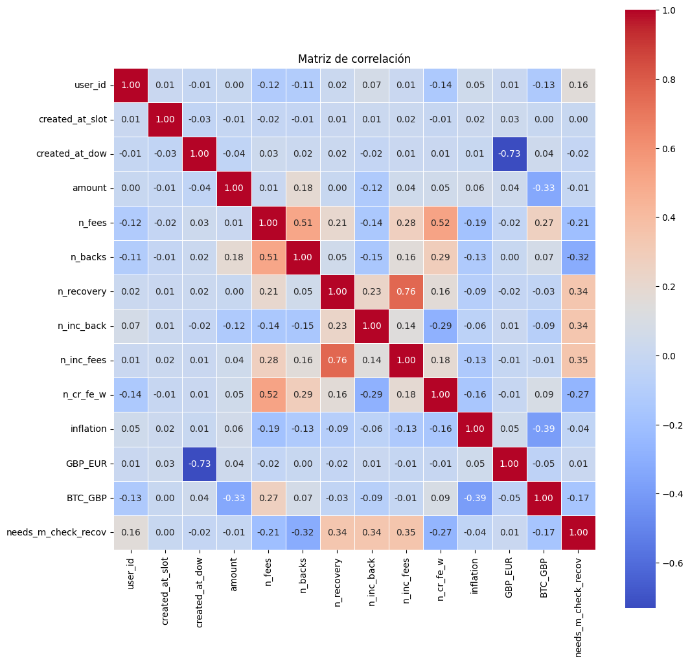
​    


    Variables altamente correlacionadas con otras:


### Campos cualitativos a cuantitativos


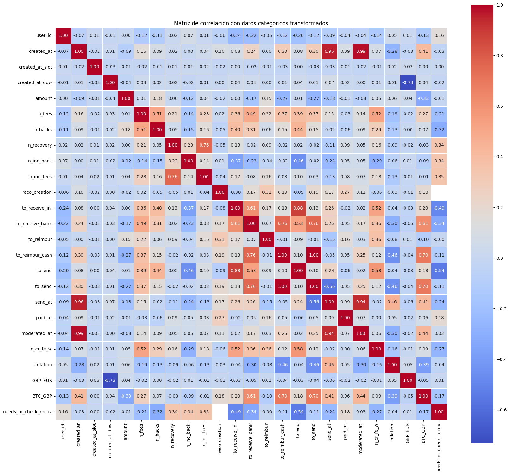
    


    Variables altamente correlacionadas con otras:
    ['created_at',
     'to_receive_ini',
     'to_reimbur_cash',
     'to_end',
     'to_send',
     'send_at',
     'moderated_at']


---

>  [!WARNING] 
>
> (7) **Análisis de Outliers**: Detectar y tratar los valores atípicos (outliers) presentes en los datos para mejorar la precisión de los modelos.


### Plazos de los prestamos


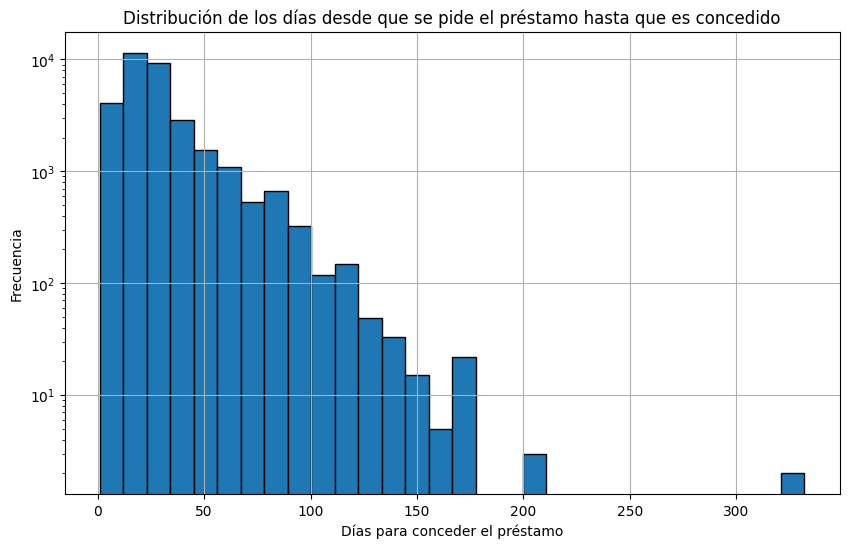
    

### Tiempo en el que la empresa realmente ha prestado el dinero

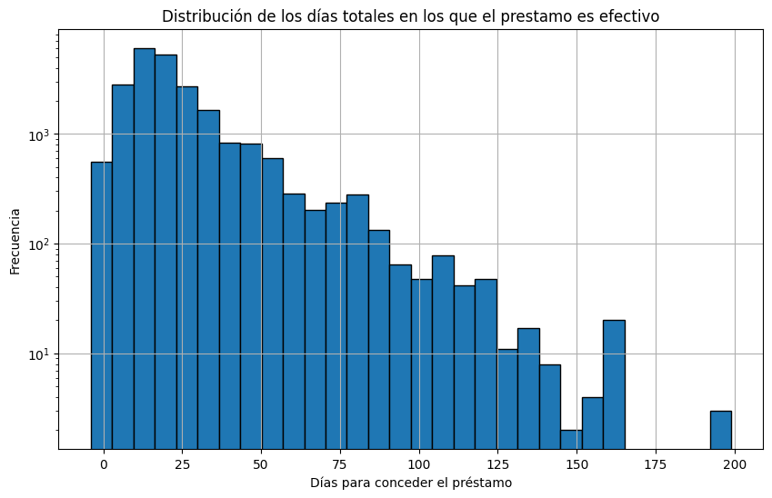
    

#### Outliers encontrados

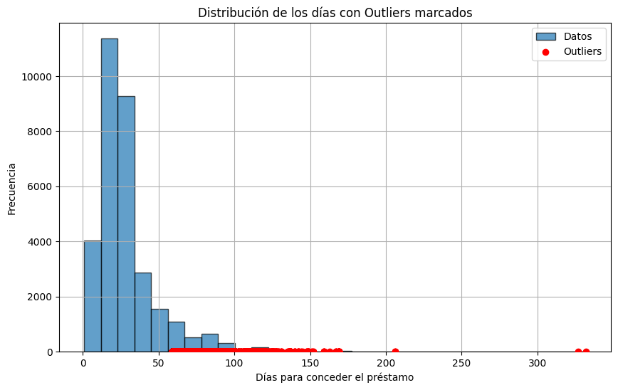
    .

---

..

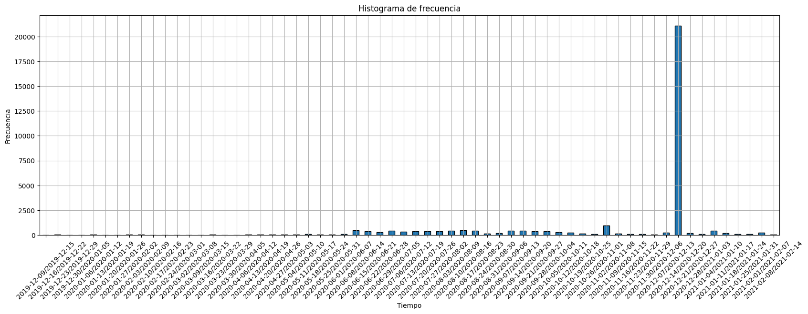
       ..


---

---


## Análisis de Cohortes Avanzados

>  [!WARNING] 
>
> (8) **Análisis de Cohortes Avanzados**: Realizar segmentación y análisis del comportamiento de los usuarios a lo largo del tiempo, con el objetivo de identificar patrones de retención, uso y otros comportamientos clave.


## Modelos de Regresión Regularizados

>  [!WARNING] 
>
> (9) **Modelos de Regresión Regularizados**: Implementar modelos de regresión regularizados (como Ridge, Lasso, ElasticNet), utilizando técnicas de búsqueda de hiperparámetros para optimizar el rendimiento del modelo.


## Modelos de Clasificación

>  [!WARNING] 
>
> (10) **Modelos de Clasificación**: Desarrollar y optimizar modelos de clasificación (como árboles de decisión, SVM, k-NN), utilizando los métodos adecuados de validación y evaluación.


## Validación de Modelos

>  [!WARNING]
>
> (11) **Validación de Modelos**: Seleccionar los mejores modelos mediante validación cruzada con k-fold, para asegurar la robustez y generalización de los modelos creados.


