## Calidad de datos

### Fechas faltantes, se han calculado la medias:

* 2,94 días de demora promedio en las transferencias bancarias.
* 31.6: Promedio del tiempo que tarda la empresa en cobrar los fee.
> Este podría ser un caso donde se puede crear un modelo para realizar la interpolación de los datos faltantes.


### Identificar datos erróneos e incorporarlos en la librería:

El cliente a devuelto el préstamo pero en los datos no figura la fecha de reembolso del banco o la fecha establecida en el sistema.

```python
df_jo['money_back_date'] = df_jo.apply(
            lambda row: row['reimbursement_date'] 
            if ( pd.isna(row['money_back_date']) & (row['stat_cr'] == 'money_back') ) 
            else row['money_back_date'], axis=1
        )
df_jo['cr_received_date'] = df_jo.apply(
    lambda row: row['send_at']+ pd.DateOffset(days=3) 
    if ( pd.isna(row['cr_received_date']) & (row['stat_cr'] == 'money_back') ) 
    else row['cr_received_date'], axis=1
)
```

### Segmentación:

### Retraso (por ID de Cash Request) al devolver el préstamo detallando el tipo de Fee:

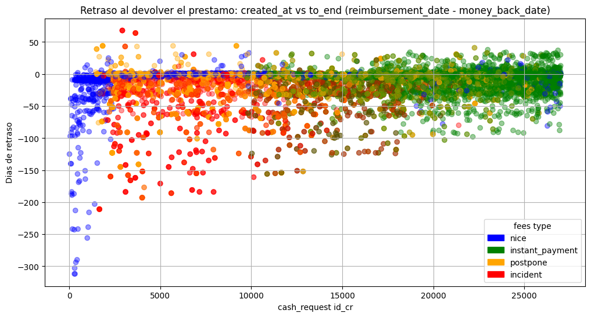

### Retraso (por Fecha de Cash Request) al devolver el préstamo detallando el tipo de Fee:

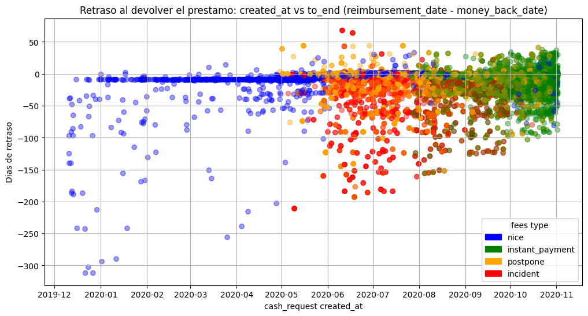

### Comparacion de prestamos y fees

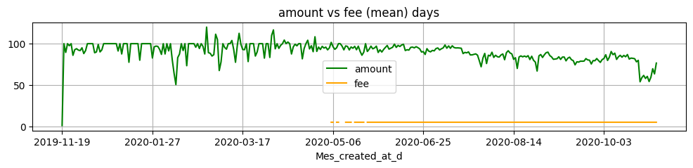
> Se observa el momento en el que se introducen los prestamos instant y empieza el cobro de fees

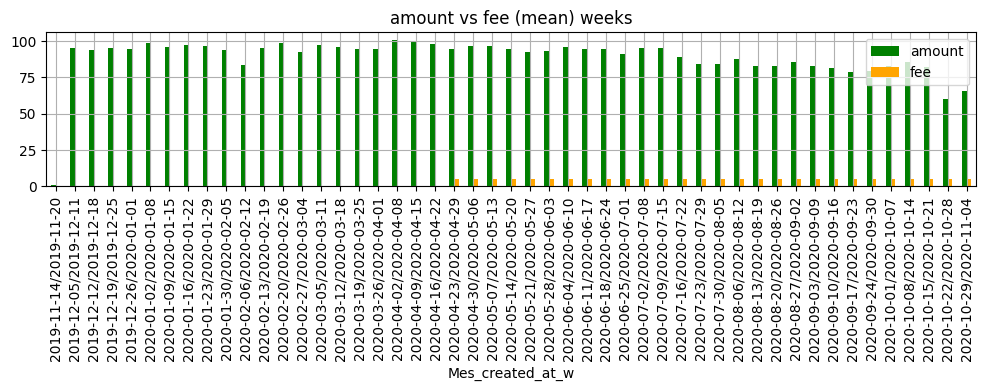

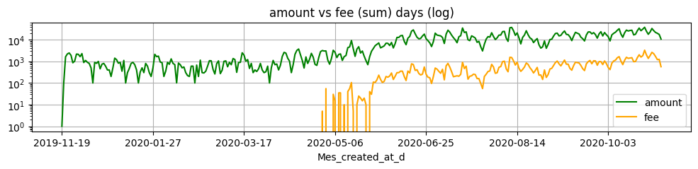

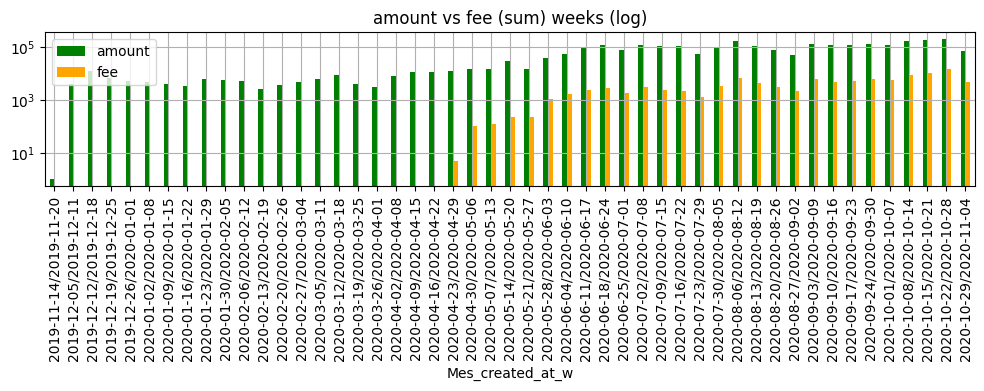
> Se observa la adoción por parte de los usuarios del servicio que implica pagos.


### Importes de los prestamos

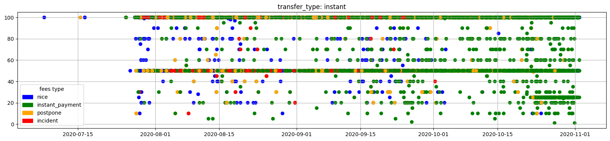

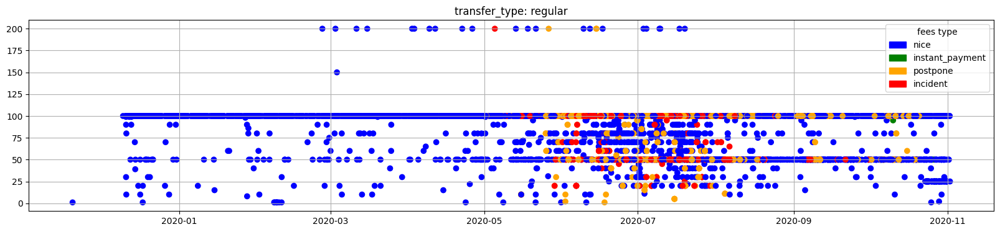

### Correlaciones descartando columnas auxiliares de fechas

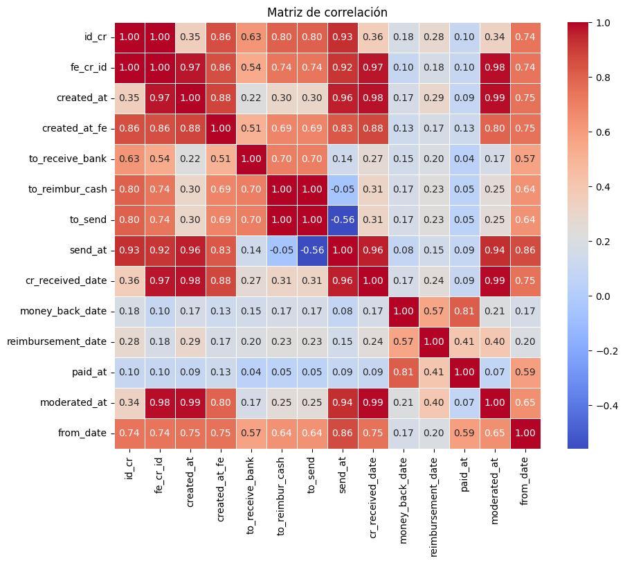

### Campos cualitativos a cuantitativos

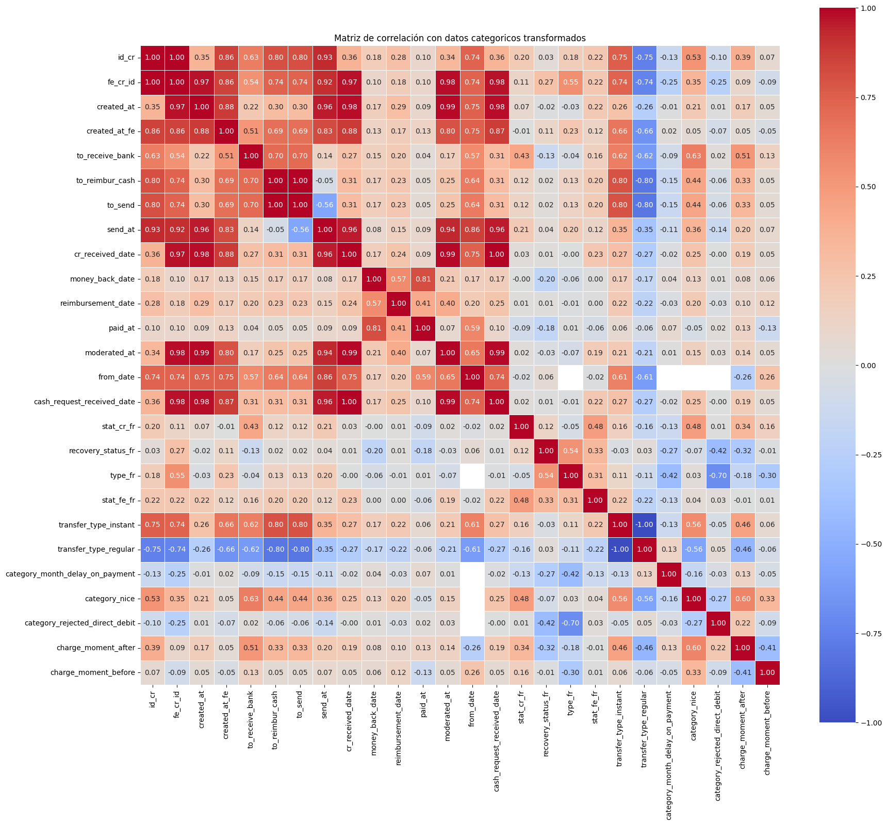

### Analisis de Series Temporales y Ruido asociado

### Cash Request created_at / amount

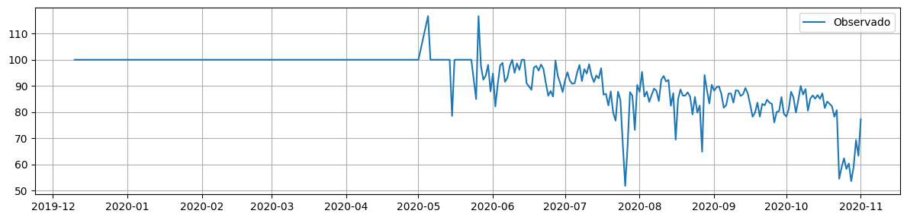

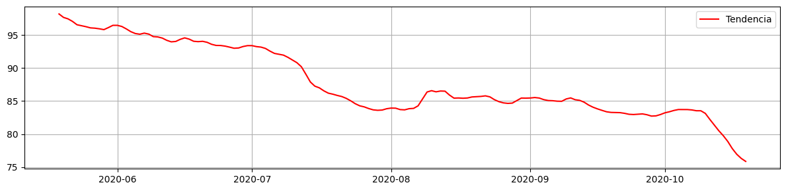
> Se aprecia un descenso de importe medio solicitado a lo largo del periodo.

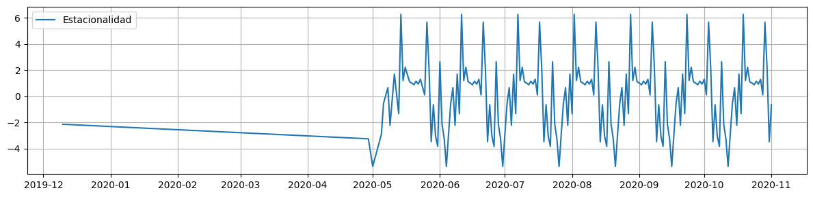 

> Se aprecia un aspecto semanal de los datos al ver la evolucion a lo largo del periodo.