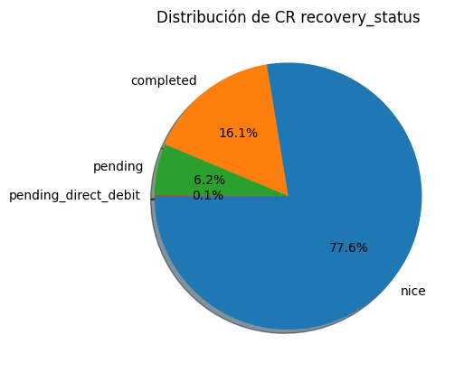
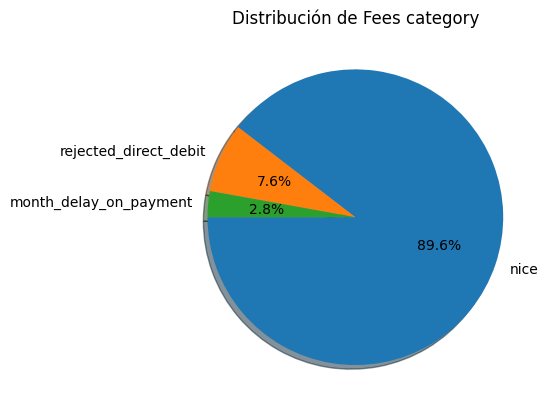
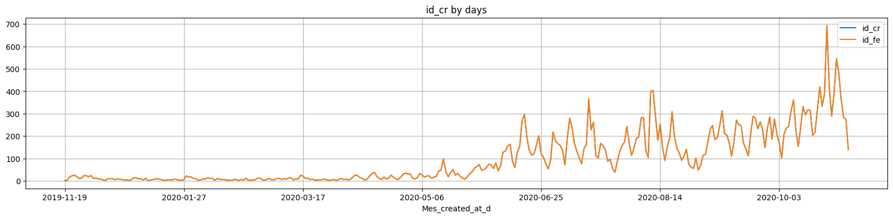
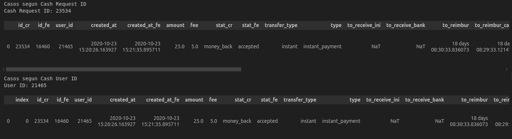

## Estructura de los Datos

### Cash_Request (CR)

##### CR.Status (23970 registros)

- **money_back**: 16397 registros. El CR fue reembolsado exitosamente.
- **rejected**: 6568 registros. El CR necesitó una revisión manual y fue rechazado.
- **direct_debit_rejected**: 831 registros. El intento de débito directo SEPA falló.
- **active**: 59 registros. Los fondos fueron recibidos en la cuenta del cliente.
- **transaction_declined**: 48 registros. No se pudo enviar el dinero al cliente.
- **canceled**: 33 registros. El usuario no confirmó el CR en la app, fue cancelado automáticamente.
- **direct_debit_sent**: 34 registros. Se envió un débito directo SEPA, pero aún no se confirma el resultado.

| CR Status             | Regs(join y limpiar) |
| --------------------- | -------------------: |
| money_back            |                23268 |
| rejected              |                 6568 |
| direct_debit_rejected |                 1941 |
| active                |                  158 |
| direct_debit_sent     |                   74 |
| transaction_declined  |                   48 |
| canceled              |                   35 |

##### CR.Transfer Type

- **instant**: El usuario eligió recibir el adelanto instantáneamente.
- **regular**: El usuario eligió no pagar inmediatamente y esperar la transferencia.

| transfer_type | regs(join y limpiar) |
| ------------- | -------------------: |
| instant       |                19488 |
| regular       |                12604 |

##### CR.Recovery Status

- **null**: El CR nunca tuvo un incidente de pago.
- **completed**: El incidente de pago fue resuelto (el CR fue reembolsado).
- **pending**: El incidente de pago aún está abierto.
- **pending_direct_debit**: El incidente de pago sigue abierto, pero se ha lanzado un débito directo SEPA.

| recovery_status      | regs(join y limpiar) |
| -------------------- | -------------------: |
| nice (null)          |                24893 |
| completed            |                 5166 |
| pending              |                 1996 |
| pending_direct_debit |                   36 |
| cancelled            |                    1 |

### Fees (FE)

##### FE.Type

- **instant_payment**: Fees por adelanto instantáneo.
- **split_payment**: Fees por pago fraccionado (en caso de un incidente).
- **incident**: Fees por fallos de reembolsos.
- **postpone**: Fees por la solicitud de posponer un reembolso.

| type            | regs(join y limpiar) |
| --------------- | -------------------: |
| instant_payment |                11095 |
| nice  (null)    |                11037 |
| postpone        |                 7765 |
| incident        |                 2195 |

##### FE.Status

- **confirmed**: El usuario completó una acción que creó un fee.
- **rejected**: El último intento de cobrar el fee falló.
- **cancelled**: El fee fue creado pero cancelado por algún motivo.
- **accepted**: El fee fue cobrado exitosamente.

| stat_fe   | regs(join y limpiar) |
| --------- | -------------------: |
| accepted  |                14839 |
| cancelled |                 4934 |
| rejected  |                 1194 |
| confirmed |                   88 |

##### FE.Category

- **rejected_direct_debit**: Fees creados cuando el banco del usuario rechaza el primer débito directo.
- **month_delay_on_payment**: Fees creados cada mes hasta que el incidente se cierre.
- **null**: No figura a la documentacio

| category               | regs(join y limpiar) |
| ---------------------- | -------------------: |
| nice  (null)           |                18860 |
| rejected_direct_debit  |                 1598 |
| month_delay_on_payment |                  597 |

##### FE.Charge Moment

- **before**: El fee se cobra en el momento de su creación.
- **after**: El fee se cobra cuando el CR es reembolsado.

| charge_moment | Regs(join y limpiar) |
| ------------- | -------------------: |
| after         |                16719 |
| before        |                 4336 |

---
## Visión global de datos

### Distribución del campo recovery_status en Cash Request:

* (nice) Null if the cash request never had a payment incident.
* completed : the payment incident was resolved (=the cash request was reimbursed)
* pending : the payment incident still open
* pending_direct_debit : the payment incident still open but a SEPA direct debit is launched

### Distribución del campo category en Fees (incidencias en Fees):

* rejected_direct_debit : fees created when user's bank rejects the first direct debit
* month_delay_on_payment : fees created every month until the incident is closed

### Evolucion de la cantidad de IDs en Cash Request a lo largo del tiempo.

> Podemos observar la periodicidad semanal y un periodo en septiembre del 2020 donde cae la cantidad, donde podriamos profundizar en detalle.

### Examinar casos de clientes concretos

* Clientes que identificamos como "Vips" al examinar en detalle su cantidad de prestamos:
    * 1946 Parece un ejemplo de buena gestión, al final tiene un instant y se le ha dado margen en las demoras.
    * 1987 Parece un ejemplo de buen usuario, se pasa a instant para siempre.
    * 90 Este parece que se esté gestionando mal: todos instant, con demoras y sin gestión aparente ?.
    * Algunos más: 12934, 526, ...

> Nos ha resultado muy útil consultar los datos con un pequeño bloque de código en vez de recurrir constantemente a una hoja de calculo.
