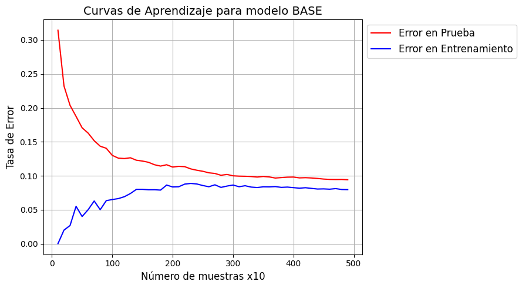
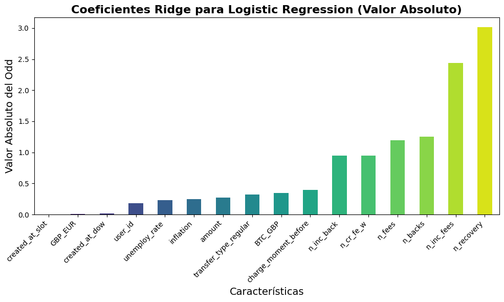
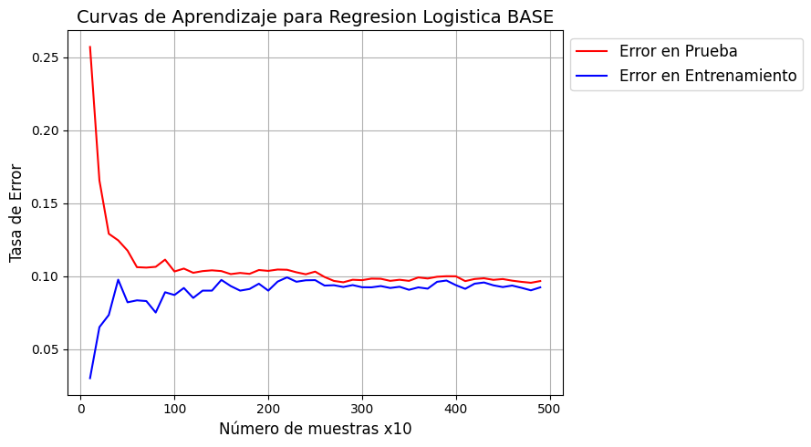
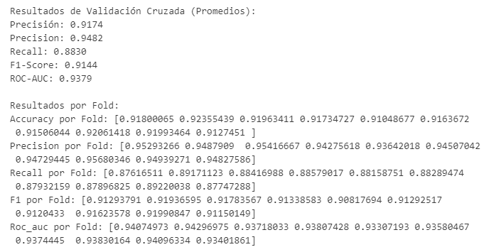

# **MODELO DE REGRESIÓN LOGÍSTICA**

# Preliminares:
- Características consideradas (JUSTIFICAR)
- Rellenar ceros (JUSTIFICAR)
- Poner lo de news y repetitivo

# Introducción

Este análisis explica la implementación de modelos de Regresión Logística para **predecir la necesidad de verificación manual (neeed manual check) en nuestro conjunto de datos**. Las características que se han incluido en este estudio son las justificadas previamente en nuestro *df_hyper*, por lo tanto al empezar esta implementación contamos con 16 características (6 de ellas calculadas por nosotros, 4 exógenas añadidas y el resto del conjunto de datos original) más la variable objetivo (columna no original).

# Preliminares

La Regresión Logística trata de modelar la probabilidad de una **variable cualitativa binaria** (dos posibles valores) en función de una o más variables independientes. Esta regresión transforma el valor devuelto por la regresión con una función cuyo resultado siempre está comprendido entre 0 y 1. Una de las más utilizadas para hacer esto es la *función sigmoide*.
Es importante también tener presente que la regresión logística exige que haya poca o ninguna multicolinealidad entre las variables independientes, lo que significa que las variables independientes no deben estar demasiado correlacionadas entre sí.

En la Regresión Logística los coeficientes representan el cambio logarítmico en las probabilidades (`log-odds`) asociado a un incremento unitario en la variable independiente (y manteniendo todas las demás constantes). Un coeficiente positivo indica que un aumento en la variable independiente incrementa la probabilidad de la clase positiva, mientras que un coeficiente negativo sugiere lo contrario. Esto es porque la exponencial de los coeficientes nos dan el cambio multiplicativo en los odds.

Este estudio que se detalla más adelante ha sido implementado con **todos los datos de los que disponemos**. Pero se han hecho pruebas del análisis con segmentaciones de datos. Se dividió el conjunto de datos entre *usuarios repetitivos* y *usuarios nuevos* (nuevos por ser la primera interacción que tienen con la aplicación) y se hizo el mismo estudio. Los resultados para regresión logística nos dicen que **la segmentación no mejora el aprendizaje** por lo que solo mostraremos los resultados obtenidos para todos los usuarios (todos los datos).

# Preparación de Datos

1. **Balanceo de Clases**: 

Se utilizó el método de remuestreo RandomUnderSampler para equilibrar las clases en la variable objetivo. 

    Tamaño original: 32,092 muestras.
    Tamaño balanceado: 30,608 muestras (15,304 por clase).

2. **Transformaciones**:

    - Las variables categóricas fueron convertidas a numéricas mediante codificación `OneHotEncoding`.

    - Los valores faltantes en las variables numéricas se rellenaron con ceros. (JUSTIFICACIÓN??)

    - Se estandarizaron las características utilizando `StandardScaler`. Posteriormente se provó el mismo proceso pero con otra estandarización (`MaxMinScaler`) para comparar y detectar si hubiera sido mejor elección.

# Exploración de Datos

Se calculó y visualizó la matriz de correlación. Esto ayudó a identificar si había posibles multicolinealidades.

# Modelo BASE

Se dividen los datos en conjuntos de entrenamiento (80%) y prueba (20%). El modelo base es entrenado con `LogisticRegression` con el `solver='liblinear'` y con la penalización por defecto que es la L2.

La curva de aprendizaje de este modelo nos indica que todo parece fluir de manera correcta.

# Regularización L1 y L2

Se aplica regularización para intentar reducir la cantidad de características y tener un modelo menos complejo a la vez que se mitiga, si lo hubiera, el sobreajuste.

- Lasso (L1): Se implementa con el `penalty_solver='l1'` y el `solver='saga'` para promover la selección de características.
- Ridge (L2): Se implementa con el `penalty_solver='l2'` y el `solver='lbfgs'` para reducir la varianza y evitar sobreajuste.

`Accuracy L1 (LASSO): 0.9175`

`Accuracy L2 (Ridge): 0.9175`

Esta regularización se ha aplicado con el valor `C=1`. C es el inverso de α, que es la que mide la intensidad de la penalización. Por lo tanto, para α pequeñas (penalización leve) tenemos C muy grandes. Y en cambio para α grandes (penalización fuerte) tenemos C pequeñas. Este detalle es importante para entender que nuestro parámetro de regularización C es inversamente proporcional a la intensidad de la penalización.

# Selección del Hiperparámetro C (1/α)

Se utilizó `LogisticRegressionCV` con validación cruzada para poder encontrar los valores óptimos de C, de manera que se aplica la penalización justa que encuentra el mejor desempeño del modelo.
Los resultados obtenidos son:

- L1 (Lasso) obtiene `C óptimo = 2,78`
- L2 (Ridge) obtiene `C óptimo = 166,81`

Esto significa que para L1 la C óptima aplica una penalización más fuerte que para L2.

Podemos ver la que L2 tiene una curva más estable para C pequeñas. Así que L2 es robusta frente a los cambios de C (de la regularización).

# Selección de coeficientes

La regularización L1 (Lasso) identifica a las 16 características como relevantes y por lo tanto no manda ninguna a cero. Aún así se pueden ver las diferencias de valores entre unas y otras.
En cuanto a regularización L2 (Ridge), donde todos los coeficientes permanecen, se observa que los coeficientes significativos son los mismos que para L1.

Ridge y Lasso aún así, tienen valores distintos para los coeficientes. Son diferencias pequeñas pero las hay, a pesar de que en este caso todo parece ser idéntico para ambas regularizaciones.

Podemos ver que tienen un desempeño similar pero que L2 es más robusto y estable tanto en Accuracy, AUC-ROC y LogLoss para C pequeñas.
Con esta información decidimos aplicar esta C óptima al modelo regularizado con L2 (Ridge)  y poder observar la curva de aprendizaje que genera por si aparecen comportamientos no deseados.

# PCA para reducción de dimensionalidad

Debido al número de características que tiene nuestro conjunto de datos y después de ver que la regularización Lasso no quita ninguna de ellas, procedemos al análisis de componentes principales para **reducir la dimensionalidad**. 

Al empezar el análisis de PCA se observa que con las dos primeras componentes principales solo se explica el 0,3 aprox de la varianza. Siguiendo esta vía, se grafica cuántas características principales se necesitan para explicar el 0,9 de la varianza. El resultado nos dice que son 11 características.
Los resultados del modelo con este PCA son muy parecidos al modelo BASE pero con 5 características menos. 

`Accuracy = 0.9176`

# Modelo con selección manual de Características

Debido al profundo estudio que hemos hecho de nuestros datos y del conocimiento que hemos ido asimilando durante el proceso de creación de columnas nuevas significativas para la predicción de nuestra variable objetivo hemos decidido probar nuestro modelo con una **selección manual de características** que creemos que seran suficientemente buenas para la predicción. La selección de características se basa en resultados que hemos estudiado con distintas combinaciones.

Características de la selección manual = `'n_inc_fees','n_recovery','n_fees','n_backs','n_cr_fe_w','BTC_GBP'`

La curva de aprendizaje para este modelo tiene un comportamiento aceptable y sin signos de sobreajuste.

Hacemos Validación Cruzada para corroborar que nuestro modelo final tiene capacidad de generalización y tiene buen rendimiento.

**Importancia de las Características en el modelo final**

Los coeficientes del modelo permiten interpretar las variables más influyentes:

1. Variables Positivas (Incrementan la Probabilidad de Clase Positiva):

    - `n_recovery` (odds ≈ 15.59): Tiene el mayor impacto, lo que sugiere que las observaciones con más `n_recovery` están significativamente asociadas con la necesidad de verificación manual (´`need_m_check'`).

    - `n_inc_fees` (odds ≈ 14.23): Indica una fuerte relación entre el número de incidencias en fees y la clase positiva (`'need_m_check'=1`).

2. Variables Negativas (Reducen la Probabilidad de Clase Positiva):

    - `n_backs` (odds ≈ 0.25): El número de adelantos devueltos está asociado con menor necesidad de verificación manual (´`need_m_check'`).

    - `n_fees` (odds ≈ 0.50): El número de fees pagadas reducen las probabilidades de la clase positiva (´`need_m_check'`).

    - `n_cr_fe_w` (odds ≈ 0.34): La frecuencia semanal de `cash_request` reducen las probabilidades de la clase positiva (´`need_m_check'`).

# Comparación de MODELOS

Una vez hecho todo este proceso, (como ya mencionamos el principio del análisis de regresión logística) replicamos todo este estudio pero cambiando el tipo de estandarización de datos. En lugar de usar el `StandardScaler` usamos el `MaxMinScaler`. Por lo que tenemos todo este estudio duplicado. 

Con estas **10 variantes del modelo de regresión logística** estudiamos los resultados de cada uno para comparar y poder sacar conclusiones.

COMPARATIVA RESULTADOS MODELOS (ACCURACY, AUC-ROC, FN%, Ein, Eout) STDSCALER Y MANMIX y tambien NEW/REPETITIVE_USERS

Con esta información que resume nuestros modelos, decidimos que para Regresión Logística nos quedamos con nuestro **MODELO CON SELECCIÓN MANUAL DE CARACTERÍSTICAS** con `StandardScaler`.
Aún así, para intentar mejorar la tasa de `Falsos Negativos` aplicamos una variación al umbral (`treshold`) y lo modificamos a 0.4, hecho que minima estos FN al XXX%

RESULTADOS MODELO FINAL CON UMBRAL 0.4

Nuestro estudio con el modelo de Regresión Logística llega hasta aquí, pero decidimos probar también otro tipo de modelo para el mismo problema para ver si tiene mejor desempeño y poder comparar. 