# **INFORME MODELO DE REGRESIÓN LOGÍSTICA**

# Introducción

Este análisis explica la implementación de modelos de Regresión Logística para **predecir la necesidad de verificación manual (neeed manual check) en nuestro conjunto de datos**. Las características que se han incluido en este estudio son las justificadas previamente en nuestro *df_hyper*, por lo tanto al empezar esta implementación contamos con 16 características (6 de ellas calculadas por nosotros, 4 exógenas añadidas y el resto provinentes del conjunto de datos original) más la variable objetivo (columna no original).

# Preliminares

La Regresión Logística trata de modelar la probabilidad de una **variable cualitativa binaria** (dos posibles valores) en función de una o más variables independientes. Esta regresión transforma el valor devuelto por la regresión con una función cuyo resultado siempre está comprendido entre 0 y 1. Una de las más utilizadas para hacer esto es la *función sigmoide*.
Es importante también tener presente que la regresión logística exige que haya poca o ninguna multicolinealidad entre las variables independientes, lo que significa que las variables independientes no deben estar demasiado correlacionadas entre sí.

En la Regresión Logística los coeficientes representan el cambio logarítmico en las probabilidades (`log-odds`) asociado a un incremento unitario en la variable independiente (y manteniendo todas las demás constantes). Un coeficiente positivo indica que un aumento en la variable independiente incrementa la probabilidad de la clase positiva, mientras que un coeficiente negativo sugiere lo contrario. Esto es porque la exponencial de los coeficientes nos dan el cambio multiplicativo en los odds.

Este estudio que se detalla más adelante ha sido implementado con **todos los datos de los que disponemos**. Pero se han hecho pruebas del análisis con segmentaciones de datos. Se dividió el conjunto de datos entre *usuarios repetitivos* y *usuarios nuevos* (nuevos por ser la primera interacción que tienen con la aplicación) y se hizo el mismo estudio. Los resultados para regresión logística nos dicen que **la segmentación no mejora el aprendizaje** por lo que solo mostraremos los resultados obtenidos para todos los usuarios (todos los datos).

# Preparación de Datos

1. **Balanceo de Clases**: 

Se utilizó el método de remuestreo RandomUnderSampler para equilibrar las clases en la variable objetivo. 

    Tamaño original: 32,092 muestras.
    Tamaño balanceado: 30,608 muestras (15,304 por clase).

2. **Transformaciones**:

    - Las variables categóricas fueron convertidas a numéricas mediante codificación `OneHotEncoding`. Se dispuso que `drop_first=True`.

    - Había valores NaN en una única columna, `'charge_moment'`, que provenian de hacer la join entre las dos tablas. Al haber hecho `OneHotEncoding` para transformarla en numérica nos hace desaparecer los NaN por lo que no hay valores faltantes a rellenar en ningún caso.

    - Se estandarizaron las características utilizando `StandardScaler`. Posteriormente se provó el mismo proceso pero con otra estandarización (`MaxMinScaler`) para comparar y detectar si hubiera sido mejor elección.
  

# Exploración de Datos

Se calculó y visualizó la matriz de correlación. Esto ayudó a identificar si había posibles multicolinealidades y motivó el estudio de algunas relaciones.

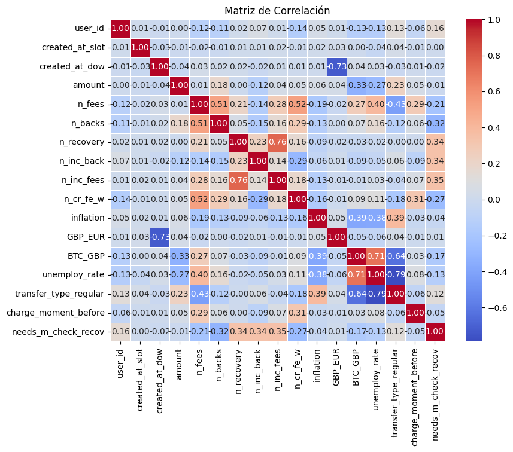

Podemos ver las gráficas de las relaciones de 2 a 2 variables.

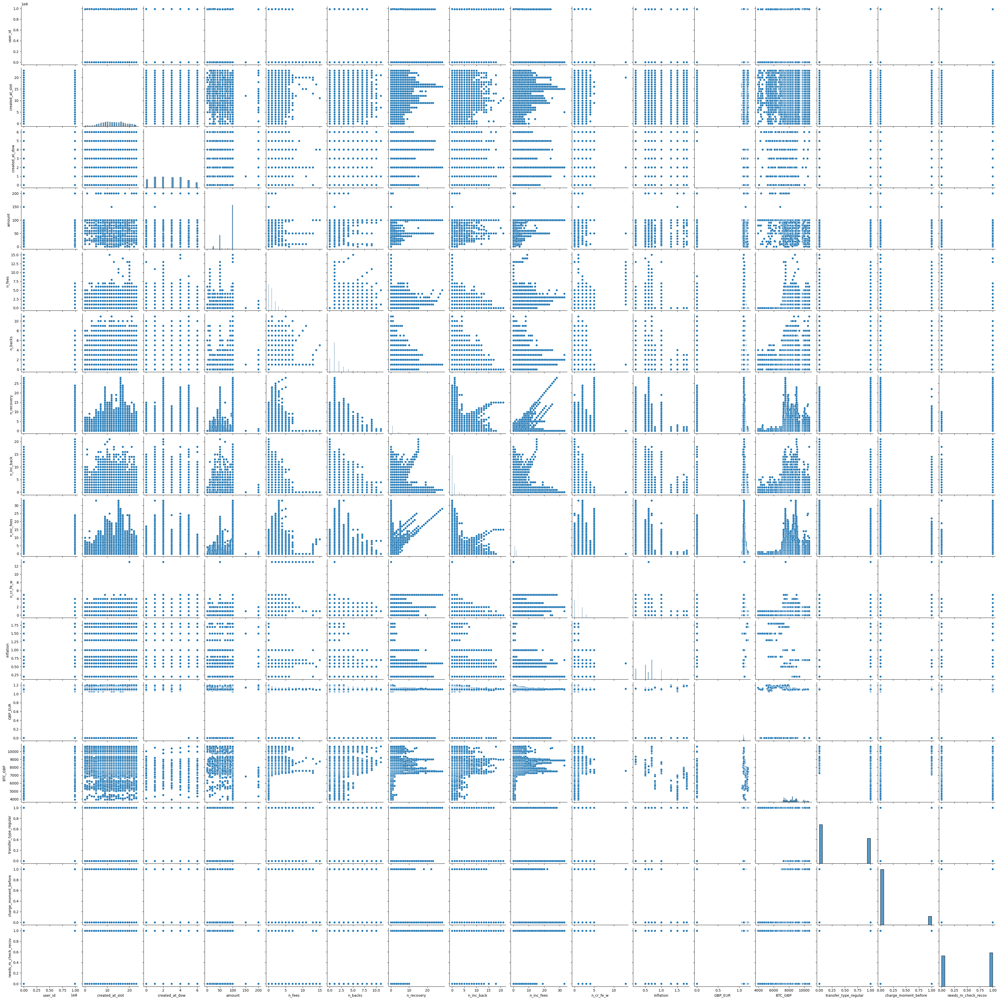

# Modelo BASE

Se dividen los datos en conjuntos de entrenamiento (80%) y prueba (20%). El modelo base es entrenado con `LogisticRegression` con la penalización por defecto que es la L2.

Se puede apreciar que para ser el punto de partida está muy bien. Tiene un desempeño notable.

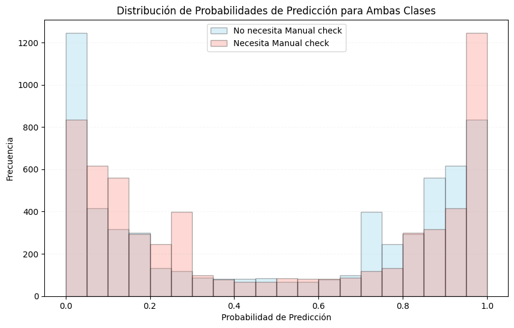

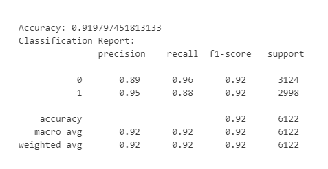

La curva de aprendizaje de este modelo nos indica que todo parece fluir de manera correcta.

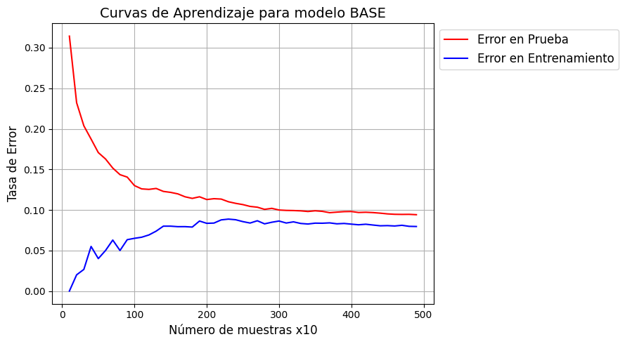

# Modelos de Regresión Regularizados - L1 y L2

Se aplica regularización para intentar reducir la cantidad de características y tener un modelo menos complejo a la vez que se mitiga, si lo hubiera, el sobreajuste.

- Lasso (L1): Se implementa con el `penalty_solver='l1'` y el `solver='saga'` para promover la selección de características.
- Ridge (L2): Se implementa con el `penalty_solver='l2'` y el `solver='lbfgs'` para reducir la varianza y evitar sobreajuste.

`Accuracy L1 (LASSO): 0.9175`

`Accuracy L2 (Ridge): 0.9175`

Esta regularización se ha aplicado con el valor `C=1`. C es el inverso de α, que es la que mide la intensidad de la penalización. Por lo tanto, para α pequeñas (penalización leve) tenemos C muy grandes. Y en cambio para α grandes (penalización fuerte) tenemos C pequeñas. Este detalle es importante para entender que nuestro parámetro de regularización C es inversamente proporcional a la intensidad de la penalización.

# Selección del Hiperparámetro C (1/α)

Se utilizó `LogisticRegressionCV` con validación cruzada para poder encontrar los valores óptimos de C, de manera que se aplica la penalización justa que encuentra el mejor desempeño del modelo.
Los resultados obtenidos son:

- L1 (Lasso) obtiene `C óptimo = 2,78`
- L2 (Ridge) obtiene `C óptimo = 166,81`

Esto significa que para L1 la C óptima aplica una penalización más fuerte que para L2.

Podemos ver la que L2 tiene una curva más estable para C pequeñas. Así que L2 es robusta frente a los cambios de C (de la regularización).

# Selección de coeficientes

La regularización L1 (Lasso) identifica a las 16 características como relevantes y por lo tanto no manda ninguna a cero. Aún así se pueden ver las diferencias de valores entre unas y otras.
En cuanto a regularización L2 (Ridge), donde todos los coeficientes permanecen, se observa que los coeficientes significativos son los mismos que para L1.

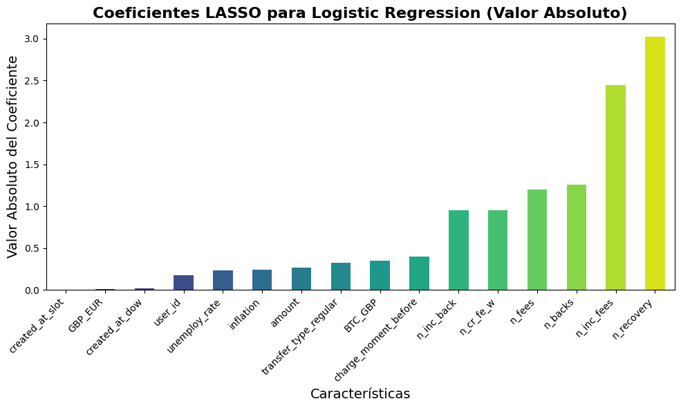

Ridge y Lasso aún así, tienen valores distintos para los coeficientes. Son diferencias pequeñas pero las hay, a pesar de que en este caso todo parece ser idéntico para ambas regularizaciones.

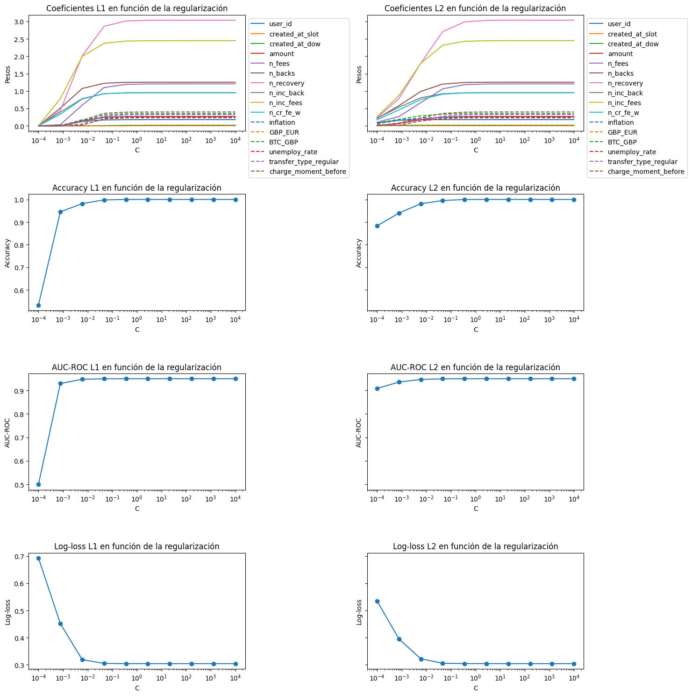

Podemos ver que tienen un desempeño similar pero que L2 es más robusto y estable tanto en Accuracy, AUC-ROC y LogLoss para C pequeñas.
Con esta información decidimos aplicar esta C óptima al modelo regularizado con L2 (Ridge)  y poder observar la curva de aprendizaje que genera por si aparecen comportamientos no deseados.

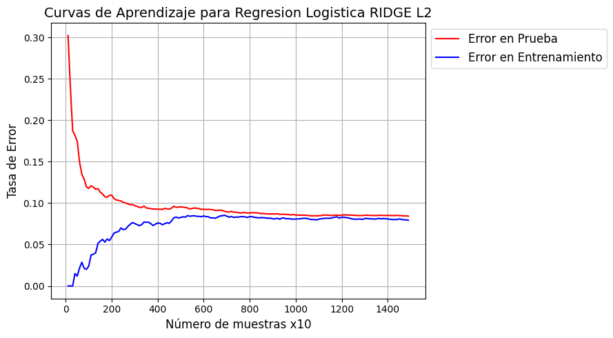

# PCA para reducción de dimensionalidad

Debido al número de características que tiene nuestro conjunto de datos y después de ver que la regularización Lasso no quita ninguna de ellas, procedemos al análisis de componentes principales para ver qué posibilidades hay de **reducir la dimensionalidad** mediante esta herramienta. 

Al empezar el análisis de PCA se observa que con las dos primeras componentes principales solo se explica el 0,3 aprox de la varianza. Siguiendo esta vía, se grafica cuántas características principales se necesitan para explicar el 0,9 de la varianza. El resultado nos dice que son 11 características.
Los resultados del modelo con este PCA son muy parecidos al modelo BASE pero con 5 características menos. 

`Accuracy = 0.9176`

La curva de aprendizaje parece tener menos estabilidad que las que hemos visto hasta ahora e incluso hay un punto donde se cruzan las líneas de errores.

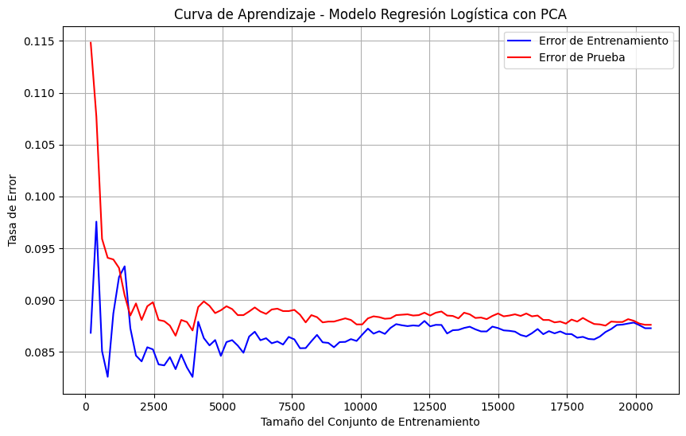

# Modelo con selección manual de Características

Debido al profundo estudio que hemos hecho de nuestros datos y del conocimiento que hemos ido asimilando durante el proceso de creación de columnas nuevas significativas para la predicción de nuestra variable objetivo hemos decidido probar nuestro modelo con una **selección manual de características** que creemos que seran suficientemente buenas para la predicción. La selección de características se basa en resultados que hemos estudiado con distintas combinaciones.

Características de la selección manual = `'n_inc_fees','n_recovery','n_fees','n_backs','n_cr_fe_w','BTC_GBP'`

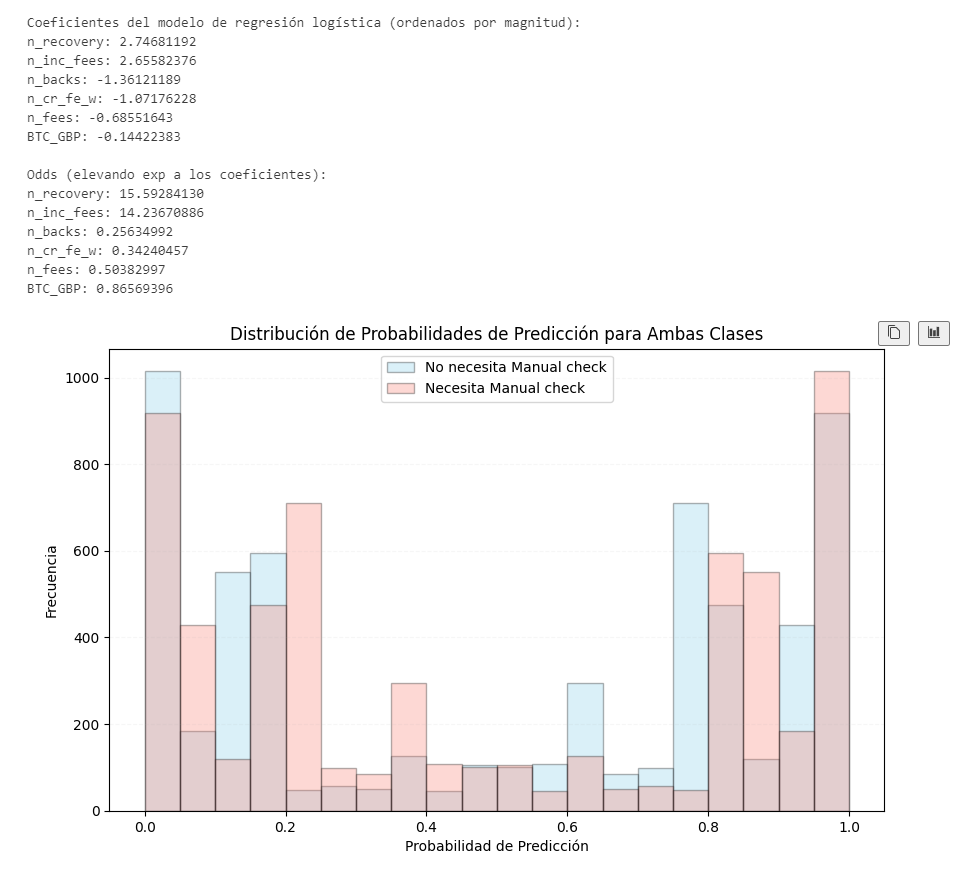

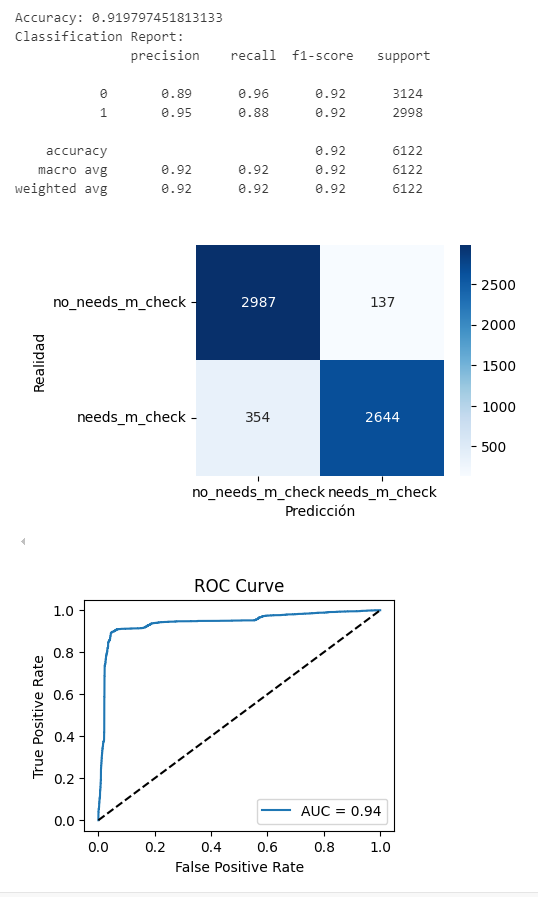

La curva de aprendizaje para este modelo tiene un comportamiento aceptable y sin signos de sobreajuste.

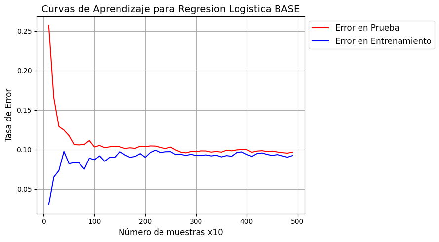

Hacemos Validación Cruzada para corroborar que nuestro modelo con selección de características manual tiene capacidad de generalización y tiene buen rendimiento. De hecho, tiene la misma Accuracy que el modelo BASE que trabajaba con todas las características (16).
Podemos ver que las métricas por cada fold tienen todas valores muy similares y por lo tanto no parece haber nada que nos indique un mal funcionamiento o sobreajuste. 

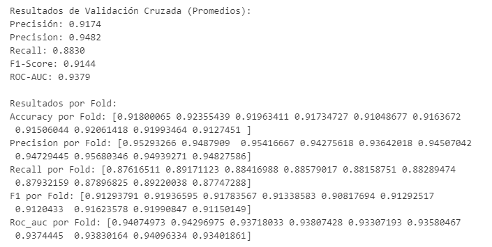

**Importancia de las Características en el modelo con selección manual de características**

Los coeficientes del modelo permiten interpretar las variables más influyentes:

1. Variables Positivas (Incrementan la Probabilidad de Clase Positiva):

    - `n_recovery` (odds ≈ 15.59): Tiene el mayor impacto, lo que sugiere que las observaciones con más `n_recovery` están significativamente asociadas con la necesidad de verificación manual (´`need_m_check'`).

    - `n_inc_fees` (odds ≈ 14.23): Indica una fuerte relación entre el número de incidencias en fees y la clase positiva (`'need_m_check'=1`).

2. Variables Negativas (Reducen la Probabilidad de Clase Positiva):

    - `n_backs` (odds ≈ 0.25): El número de adelantos devueltos está asociado con menor necesidad de verificación manual (´`need_m_check'`).

    - `n_fees` (odds ≈ 0.50): El número de fees pagadas reducen las probabilidades de la clase positiva (´`need_m_check'`).

    - `n_cr_fe_w` (odds ≈ 0.34): La frecuencia semanal de `cash_request` reducen las probabilidades de la clase positiva (´`need_m_check'`).

# Comparación de MODELOS

Una vez hecho todo este proceso, (como ya mencionamos el principio del análisis de regresión logística) replicamos todo este estudio pero cambiando el tipo de estandarización de datos. En lugar de usar el `StandardScaler` usamos el `MinMaxScaler`. Por lo que tenemos todo este estudio duplicado. 

Lo que se observa al aplicar esta estandarización del `MinMaxScaler` es que la curva de aprendizaje no muestra un buen desempeño ya que se cruzan las líneas de los errores. Esto puede ser síntoma de un sobreajuste que podría explicarse debido a la mayor sensibilidad introducida por este escalador que al transofrmar los datos a un rango fijo [0,1] podría hacer al modelo más sensible a ruidos o patrones específicos en el entrenamiento.

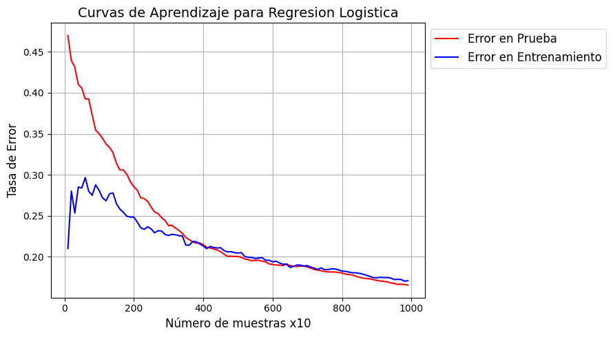

Antes de seguir, mostramos también como la segmentación de los datos en `new_users`y `repetitive_users` no llega ni supera al desempeño de nuestro modelo y por lo tanto se decide no tomar esta posible segmentación en cuenta como mejora. Para los repetitivos nuestro modelo base no logra clasificar ningún Positivo verdadero. Con la regularización Lasso mejora mucho pero sigue sin alcanzar a nuestro modelo BASE que toma todos los datos.

Resultado `repetitive_users`

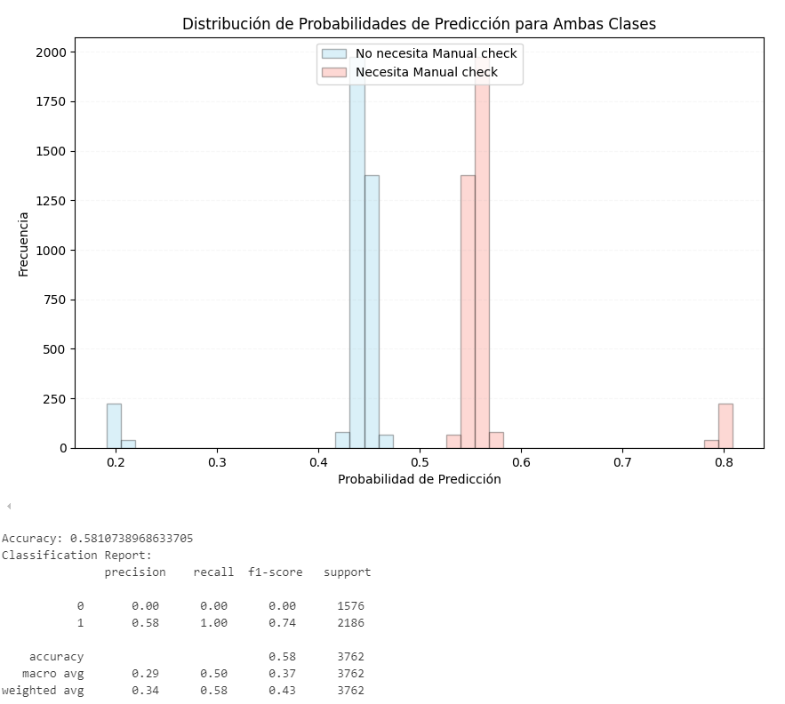

Para los usuarios nuevos (el primer registro de interacción que tenemos del usuario en nuestros datos) el modelo tampoco se desempeña tan bien como el que considera todos los datos. Aquí se puede observar una curva ROC menos ideal y una falta de capacidad del modelo para predecir los que necesitan control manual. 

Resultado `new_users`

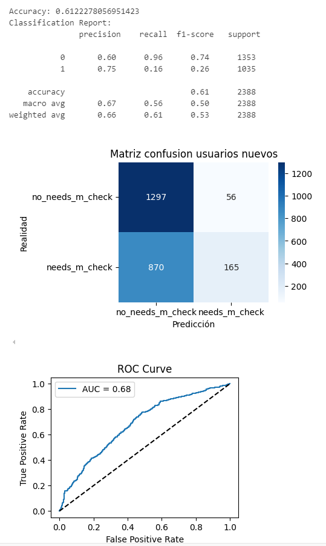

Es por esto, que en el estudio comparativo final solo contemplaremos el proceso hecho con `StandardScaler` para la estandarización y con la totalidad de los datos (tanto los usuarios repetitivos como los "nuevos"). Eso se traduce en **varios modelos de regresión logística** con distintos parámetros para los que estudiamos los resultados de cada uno y sacamos conclusiones. Entre los hiperparámetros se encuentra el C, por lo que añadimos el C óptimo encontrado previamente. 

*Apunte: *En el caso de C=1 y penalty=l2 estamos hablando de nuestro modelo BASE*.

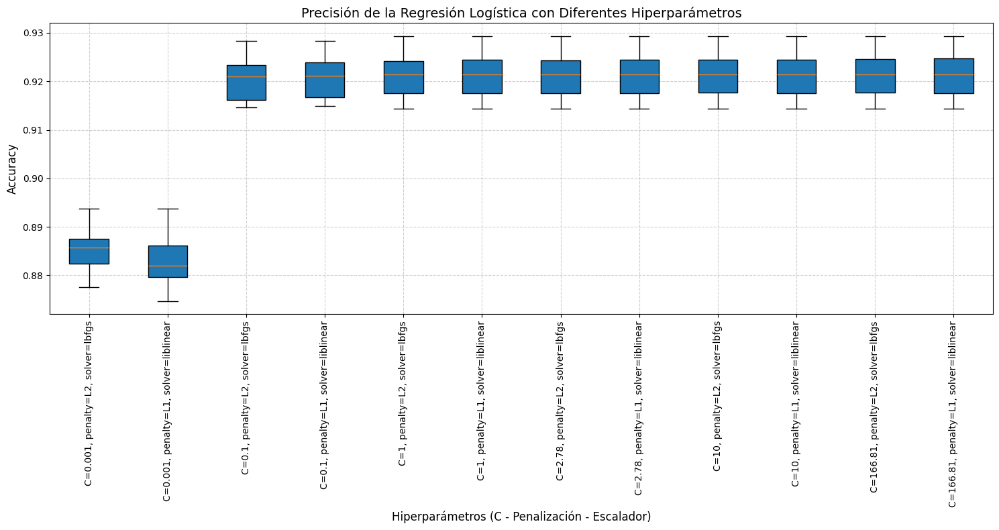

Con esta información que resume nuestros modelos, decidimos que para Regresión Logística escogemos como el mejor modelo a nuestro **MODELO CON SELECCIÓN MANUAL DE CARACTERÍSTICAS** con `StandardScaler`.
Una vez escogido, aplicamos una variación al umbral (`treshold`) para dejarlo en `0.4`, hecho que minimiza los FN al **8.67%**.

Resultado `MODELO FINAL`

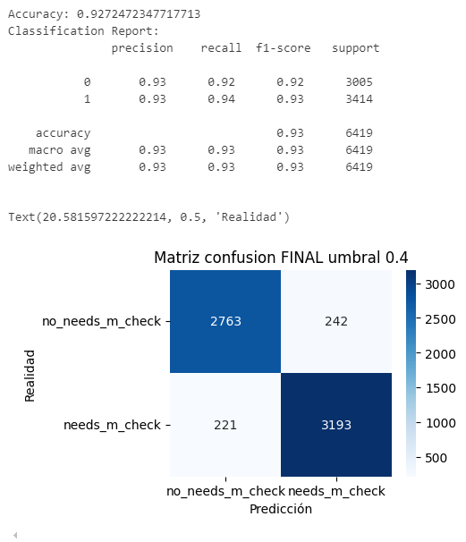

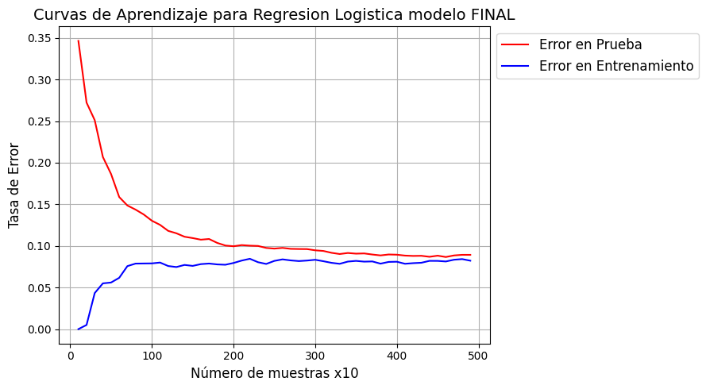

Nuestro estudio con el modelo de Regresión Logística llega hasta aquí, pero decidimos probar también otro tipo de modelo para el mismo objetivo para ver si tiene mejor desempeño y poder comparar. 