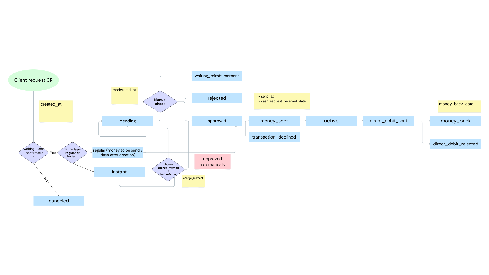
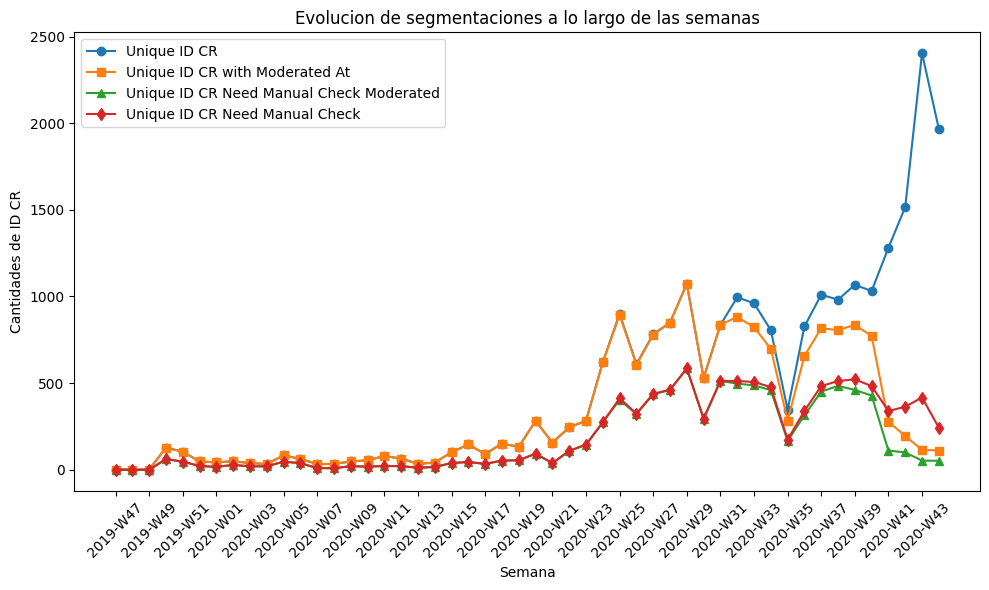
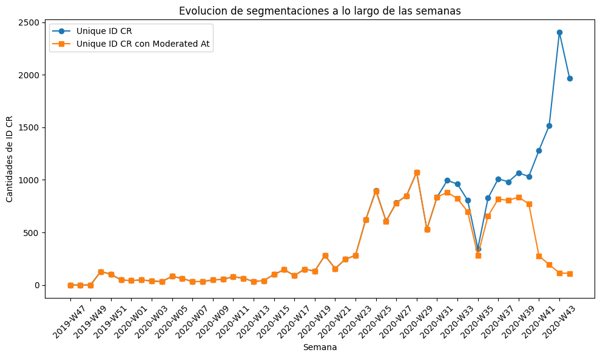
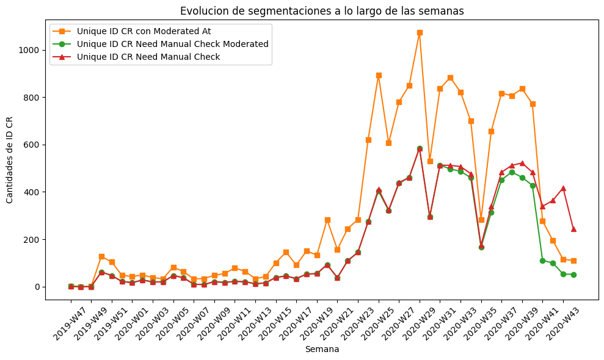
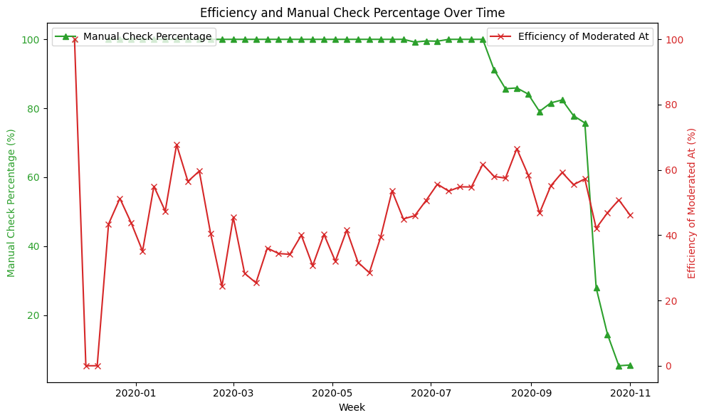
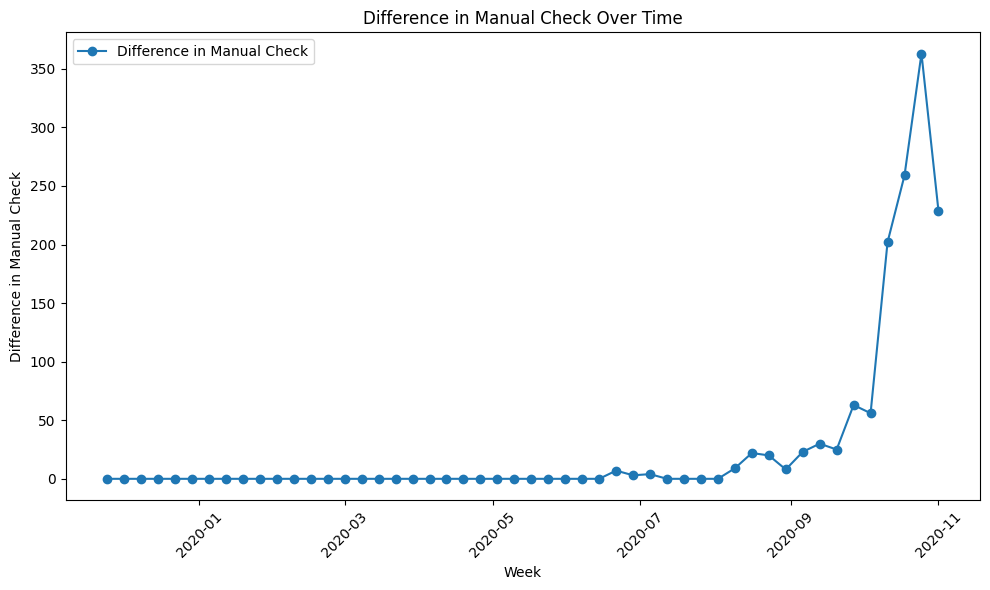
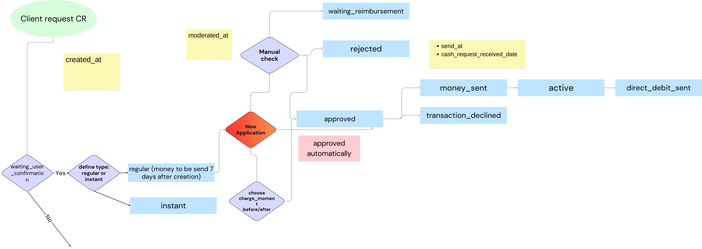

# Proyecto Pasta Loca 2

## Equipo del Proyecto

El equipo detrás de este análisis está compuesto por:

- **Francesc Pujol Contreras**: *Data Engineer*. Responsable de la limpieza de bases de datos, creación de pipelines de datos y desarrollo de librerías utilizadas por los analistas.
  
- **Maria Alba Godoy Dominguez**: *Data Scientist*. Responsable del desarrollo y optimización de los modelos predictivos.

- **Alejandro Manzano**: *Business Analyst*. Responsable de realizar el análisis funcional previo del "As Is" de lo que se busca optimizar, recopilar variables externas y análisis del contexto del negocio.

## Objetivos del Proyecto

### Modelo de clasificación

Crear un modelo que nos ayude a predecir si un nuevo *cash request* (CR) va a necesitar control manual o no.  
El objetivo es optimizar el control manual y activarlo solo para casos necesarios, mejorando así la gestión de recursos.

## **"AS IS" Manual Check**

### Diagrama de Flujo del Servicio Actual

### Análisis de rendimiento de los manual checks a lo largo de las semanas

#### Aclaraciones de Métricas:
- **Unique ID CR**: Cantidad total de CR.
- **Unique ID CR with moderated_at**: Cantidad de CR sometidos a control manual.
- **Unique ID CR Need Manual Check with moderated_at**: Cantidad de CR sometidos a control manual donde era necesario el control.
- **Unique ID CR Need Manual Check**: Cantidad total de CR donde era necesario control manual.

#### **Consideración Importante:**
Para nosotros, un CR lo etiquetamos como necesario de realizar control manual basados en las siguientes condiciones:
1. El estado del CR **NO ES**: "approved", "money_sent", "pending", "direct_debit_sent", "active", "money_back".
2. El estado de los *fees* **NO ES**: "confirmed", "accepted".
3. En la columna *recovery_status* **NO HAY** ningún valor.

---

### Conclusiones del Análisis

1. **Inicialmente, las líneas naranja y azul están solapadas**, lo que indica que el 100% de los CR se controlaban manualmente. Esto cambió en la **W27 2020**, donde estas líneas comenzaron a separarse, indicando que ya no se controlaban manualmente todos los CR.
2. **Crecimiento abrupto de CR desde la W36 2020**, que no fue acompañado por la línea naranja (manual check). Esto indica que se decidió reducir los niveles de control manual.
3. La **línea roja**, que representa los CR catalogados como necesarios de revisión manual, muestra un crecimiento gradual desde la **W32 2020**, coincidiendo con la aparición del nuevo servicio instantáneo. A partir de esta semana, algunos CR que deberían haberse controlado manualmente ya no lo fueron. A pesar del crecimiento de CR, los casos susceptibles a control se mantuvieron estables semana a semana.
4. **Caída abrupta en las órdenes de CR a controlar desde la W40 2020**, con un punto de inflexión en **W41 2020** donde la cantidad de CR controlados fue igual a la cantidad de CR susceptibles a control. Este desequilibrio, junto con un rendimiento de control manual por debajo del 60%, produjo un *gap* problemático (diferencia entre las líneas roja y verde).

---

### Gráficos de Apoyo

- **Gráfico de conclusión 2**:  
  Muestra el comportamiento de los CR a controlar a lo largo del tiempo.  
  

- **Gráfico de conclusión 4**:  
  Analiza la relación entre el rendimiento de los manual checks y la eficiencia a lo largo de las semanas.  
    
  

---

### Problema Identificado

El crecimiento casi exponencial de los CR que debieron haber sido controlados manualmente y no lo fueron se debe a la falta de criterios claros y herramientas eficaces para seleccionar los casos a controlar. Este problema se refleja en el bajo rendimiento de los controles manuales, que estuvo por debajo del 60% debido a una falta de optimización en la gestión de recursos.

  

### Solución Propuesta

Proponemos la creación de un modelo predictivo que identifique qué casos requerirán control manual, con el objetivo de mejorar los rendimientos de control manual, llevando la eficiencia de control de un 60% a al menos un 85%.

---

### Diagrama de Flujo del Nuevo Servicio

Este modelo ayudará a identificar los casos que realmente requieren control manual, optimizando así los recursos y mejorando la eficiencia de los procesos.  

---

## Conclusión

Con este proyecto, buscamos mejorar la eficiencia en el proceso de control manual de *cash requests*, utilizando un modelo predictivo para optimizar los recursos y mejorar el rendimiento general del proceso.
"""
