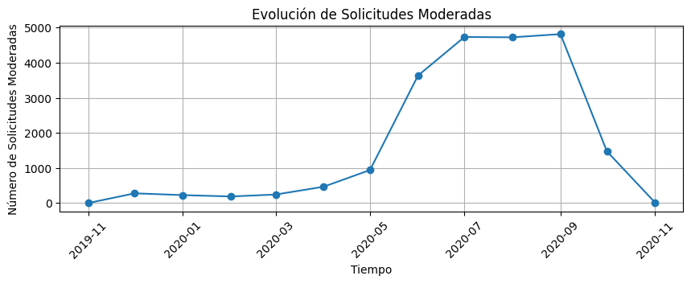
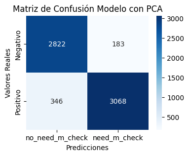
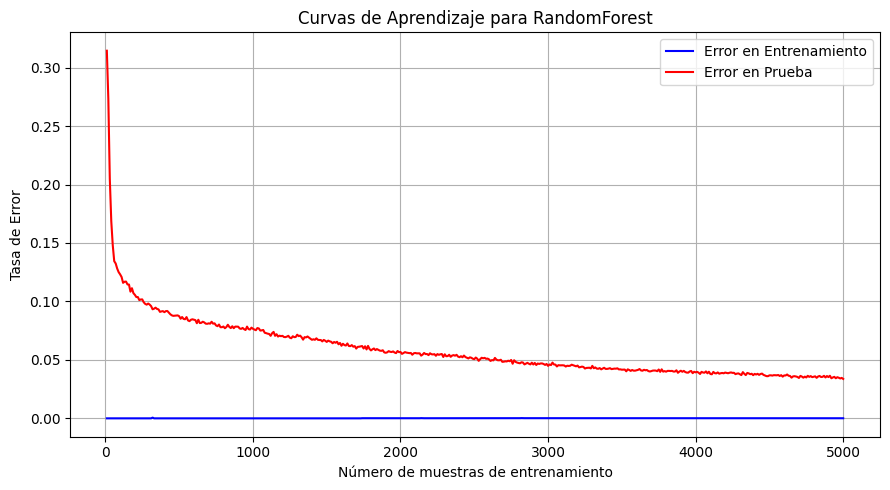
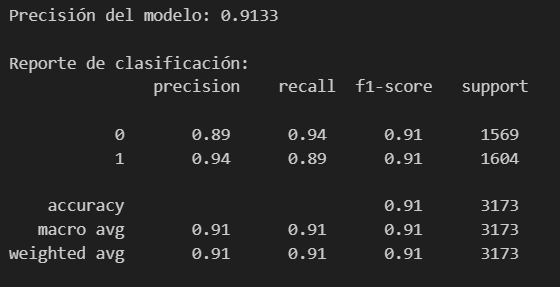
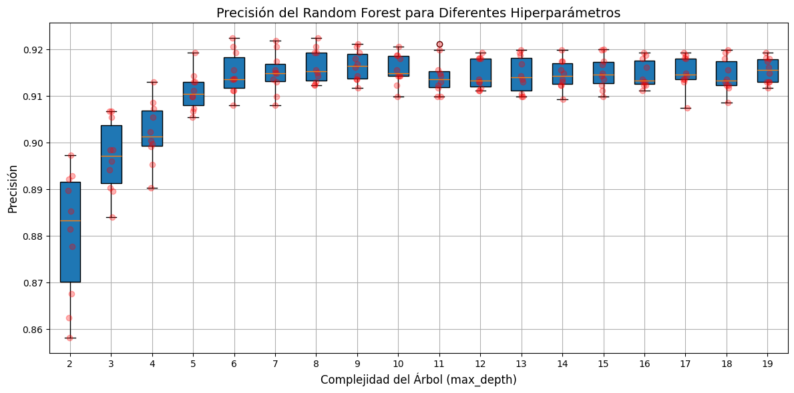
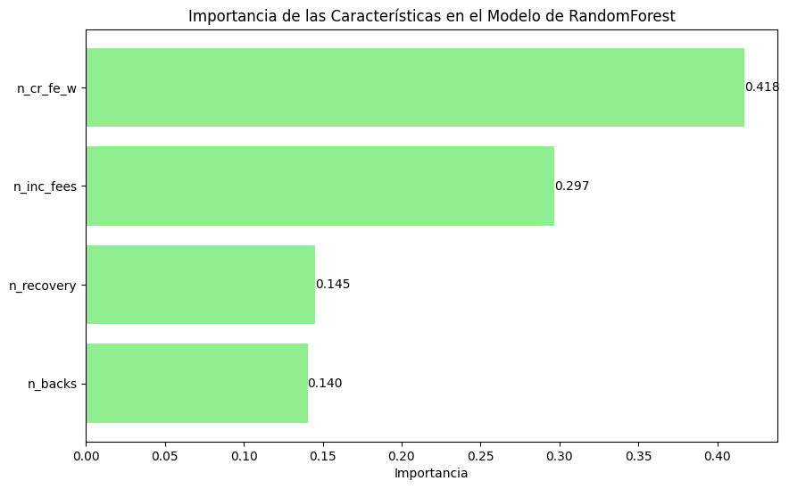
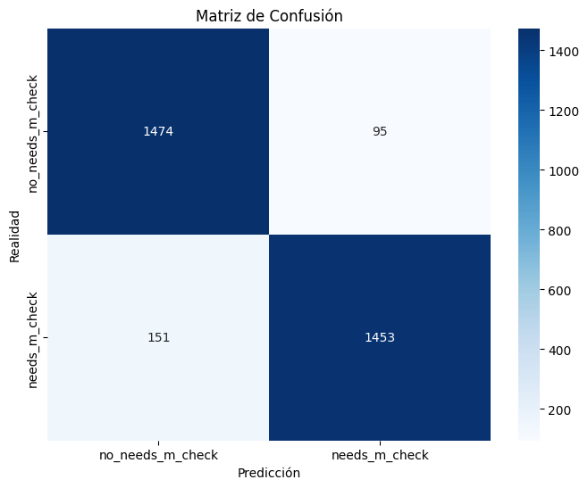
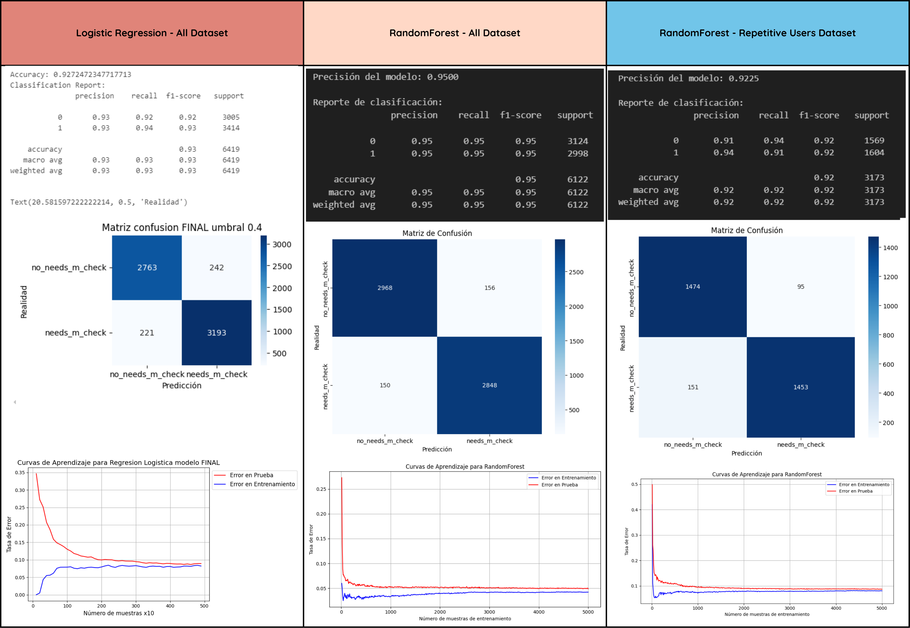

# Proyecto Pasta Loca II

#### Equipo del Proyecto

El equipo detrás de este análisis está compuesto por:

- **Francesc Pujol Contreras**: *Data Engineer & Novice Data Scientist*. Responsable de la limpieza de bases de datos, creación de pipelines de datos y desarrollo de librerías utilizadas por los analistas.
  
- **Maria Alba Godoy Dominguez**: *Data Scientist*. Responsable del desarrollo y optimización de los modelos predictivos.

- **Alejandro Manzano**: *Business Analyst*. Responsable de realizar el análisis funcional previo del "As Is" de lo que se busca optimizar, recopilar variables externas y análisis del contexto del negocio.


## Business Payments

### Introducción

Business Payments, una empresa de servicios financieros de vanguardia, ha estado ofreciendo soluciones innovadoras de adelanto de efectivo desde su creación en 2020. Con un compromiso de proporcionar adelantos de dinero gratuitos y precios transparentes, Business Payments ha logrado construir una base de usuarios sólida. Como parte de su esfuerzo continuo por mejorar sus servicios y entender el comportamiento de los usuarios, Business Payments ha encargado un proyecto para realizar un análisis avanzado de insights y cohortes.

## Visión General del Proyecto

**Resumen para la Visión General del Proyecto:**

El proyecto tiene como objetivo proporcionar un sistema de moderación, con el fin de optimizar el proceso por el que la empresa evalúa la concesión de prestamos a sus clientes.

Algunas de las tareas incluyen:

* Un análisis exhaustivo de tendencias y patrones temporales en series de tiempo.
* El uso de técnicas avanzadas de segmentación para identificar comportamientos relevantes dentro de los datos.
* La implementación de modelos de regresión y clasificación para predecir resultados y hacer moderaciones más precisas.

Nuestro objetivo es desarrollar un modelo mejorado de moderación que dependa de la evolución de la cartera de clientes, para disponer de un sistema robusto, escalable que pueda producir resultados precisos.


## Objetivos del Proyecto

### Modelo de clasificación

Crear un modelo que nos ayude a predecir si un nuevo *cash request* (CR) va a necesitar control manual o no.  
El objetivo es optimizar el control manual y activarlo solo para casos necesarios, mejorando así la gestión de recursos.


## Contexto: Estructura de los Datos

En este apartado mostramos cada uno de los registros contenidos en las tablas de nuestra base de datos. Este proceso, es fundamental para comprender la estructura y contenido de nuestros datos. Al hacerlo, podemos identificar con más facilidad las características que se explican en el análisis posterior.

### Cash_Request (CR)

##### CR.Status

- **money_back**: El CR fue reembolsado exitosamente.

---

- **active**: Los fondos fueron recibidos en la cuenta del cliente.
- **direct_debit_sent**:  Se envió un débito directo SEPA, pero aún no se confirma el resultado

---

- **rejected**: El CR necesitó una revisión manual y fue rechazado.
- **direct_debit_rejected**: El intento de débito directo SEPA falló.
- **transaction_declined**:  No se pudo enviar el dinero al cliente.
- **canceled**: El usuario no confirmó el CR en la app, fue cancelado automáticamente. 

---

**En los datos proporcionados, NO aparecen los valores:** 

- approved : CR is a 'regular' one (= without fees) and was approved either automatically or manually. Funds will be sent aprox. 7 days after the creation
- money_sent : We transferred the fund to the customer account. Will change to active once we detect that the user received the funds (using user's bank history)
- pending : The CR is pending a manual review from an analyst
- waiting_user_confirmation : The user needs to confirm in-app that he want the CR (for legal reasons)
- waiting_reimbursement : We were not able to estimate a date of reimbursement, the user needs to choose one in the app.


##### CR.Transfer Type

- **instant**: El usuario eligió recibir el adelanto instantáneamente. 
- **regular**: El usuario eligió no pagar inmediatamente y esperar la transferencia. 


##### CR.Recovery Status

- **null**: El CR nunca tuvo un incidente de pago.
- **completed**: El incidente de pago fue resuelto (el CR fue reembolsado).

---

- **pending**: El incidente de pago aún está abierto.
- **pending_direct_debit**: El incidente de pago sigue abierto, pero se ha lanzado un débito directo SEPA.

### Fees (FE)

##### FE.Type

- **instant_payment**: Fees por adelanto instantáneo. (send directly after user's request, through SEPA Instant Payment)
- **split_payment**: Fees por pago fraccionado (en caso de un incidente). (futures fees for split payment (in case of an incident, we'll soon offer the possibility to our users to reimburse in multiples installements))
- **incident**: Fees por fallos de reembolsos.
- **postpone**: Fees por la solicitud de posponer un reembolso. 

##### FE.Status (= does the fees was successfully charged)

- **accepted**: El fee fue cobrado exitosamente.
- **confirmed**: El usuario completó una acción que creó un fee.

---

- **rejected**: El último intento de cobrar el fee falló.
- **cancelled**: El fee fue creado pero cancelado por algún motivo. 

##### FE.Category

- **rejected_direct_debit**: Fees creados cuando el banco del usuario rechaza el primer débito directo.
- **month_delay_on_payment**: Fees creados cada mes hasta que el incidente se cierre.

---

- **null**: No figura a la documentacio

##### FE.paid_at:	

- Timestamp of the fee's payment

##### FE.charge_moment (When the fee will be charge).

- **before**: El fee se cobra en el momento de su creación.
- **after**: El fee se cobra cuando el CR es reembolsado.

##### FE.total_amount

- Amount of the fee (including VAT)


## "AS IS" Manual Check

### Diagrama de Flujo del Servicio Actual


### Análisis de rendimiento de los manual checks a lo largo de las semanas


#### Aclaraciones de Métricas:
- **Unique ID CR**: Cantidad total de CR.
- **Unique ID CR with moderated_at**: Cantidad de CR sometidos a control manual.
- **Unique ID CR Need Manual Check with moderated_at**: Cantidad de CR sometidos a control manual donde era necesario el control.
- **Unique ID CR Need Manual Check**: Cantidad total de CR donde era necesario control manual.

#### **Consideración Importante:**
Para nosotros, un CR lo etiquetamos como necesario de realizar control manual basados en las siguientes condiciones:
1. El estado del CR **NO ES**: "approved", "money_sent", "pending", "direct_debit_sent", "active", "money_back".
2. El estado de los *fees* **NO ES**: "confirmed", "accepted".
3. En la columna *recovery_status* **NO HAY** ningún valor.

---

### Conclusiones del Análisis

1. **Inicialmente, las líneas naranja y azul están solapadas**, lo que indica que el 100% de los CR se controlaban manualmente. Esto cambió en la **W27 2020**, donde estas líneas comenzaron a separarse, indicando que ya no se controlaban manualmente todos los CR.
2. **Crecimiento abrupto de CR desde la W36 2020**, que no fue acompañado por la línea naranja (manual check). Esto indica que se decidió reducir los niveles de control manual.
3. La **línea roja**, que representa los CR catalogados como necesarios de revisión manual, muestra un crecimiento gradual desde la **W32 2020**, coincidiendo con la aparición del nuevo servicio instantáneo. A partir de esta semana, algunos CR que deberían haberse controlado manualmente ya no lo fueron. A pesar del crecimiento de CR, los casos susceptibles a control se mantuvieron estables semana a semana.
4. **Caída abrupta en las órdenes de CR a controlar desde la W40 2020**, con un punto de inflexión en **W41 2020** donde la cantidad de CR controlados fue igual a la cantidad de CR susceptibles a control. Este desequilibrio, junto con un rendimiento de control manual por debajo del 60%, produjo un *gap* problemático (diferencia entre las líneas roja y verde).

---

### Gráficos de Apoyo

- **Gráfico de conclusión 2**:  
  Muestra el comportamiento de los CR a controlar a lo largo del tiempo.  
  

- **Gráfico de conclusión 4**:  
  Analiza la relación entre el rendimiento de los manual checks y la eficiencia a lo largo de las semanas.  
    
  

---

### Problema Identificado

El crecimiento casi exponencial de los CR que debieron haber sido controlados manualmente y no lo fueron se debe a la falta de criterios claros y herramientas eficaces para seleccionar los casos a controlar. Este problema se refleja en el bajo rendimiento de los controles manuales, que estuvo por debajo del 60% debido a una falta de optimización en la gestión de recursos.

  

### Solución Propuesta

Proponemos la creación de un modelo predictivo que identifique qué casos requerirán control manual, con el objetivo de mejorar los rendimientos de control manual, llevando la eficiencia de control de un 60% a al menos un 85%.

---

### Diagrama de Flujo del Nuevo Servicio

Este modelo ayudará a identificar los casos que realmente requieren control manual, optimizando así los recursos y mejorando la eficiencia de los procesos.  


---

## Conclusión

El presente proyecto tiene como objetivo optimizar el proceso de control manual de solicitudes de préstamos, abordando una problemática inicial en la que solo el 60% de las solicitudes controladas manualmente eran realmente necesarias. Esto generaba una sobrecarga operativa y un uso ineficiente de recursos. Utilizando técnicas de Data Science y Machine Learning, buscamos desarrollar un modelo predictivo basado en transacciones históricas que permita identificar de manera precisa cuáles solicitudes requieren un control manual.

Este modelo no solo reducirá la carga operativa al eliminar controles innecesarios, sino que también mejorará la eficiencia global del proceso, contribuyendo al uso óptimo de recursos humanos y tecnológicos. Como resultado, esperamos generar un impacto significativo en la toma de decisiones y en la calidad del servicio al cliente.

---


## Fuentes de información exógenas 

> [!NOTE]  
>
> 12. **Uso de Scraping para Variables Exógenas**: El proyecto debe incluir el uso de técnicas de web scraping para obtener variables adicionales de fuentes externas que aporten valor a los datos originales del proyecto.


Para las fuentes externas de datos, no ha sido necesario realizar scrapping. Nos encontramos con tres situaciones distintas:


### Indice de precios al consumo IPC en UK

 

```python
#Fuente: https://www.statista.com/statistics/306648/inflation-rate-consumer-price-index-cpi-united-kingdom-uk/
data = {
    'Date': ['11-2019', '12-2019', '01-2020', '02-2020', '03-2020', '04-2020', '05-2020', 
                '06-2020', '07-2020', '08-2020', '09-2020', '10-2020', '11-2020'],
    'inflation': [1.3, 1.3, 1.8, 1.7, 1.5, 0.8, 0.5, 0.6, 1.0, 0.2, 0.5, 0.7, 0.7] 
    }

# DataFrame original con datos diarios
data_inflation = pd.DataFrame(data)

# Convertir la columna 'Date' a tipo datetime con formato mensual
data_inflation['Date'] = pd.to_datetime(data_inflation['Date'], format='%m-%Y')

# Crear un rango de fechas que abarque el mes correspondiente para cada fila
data_inflation = data_inflation.set_index('Date').resample('D').ffill().reset_index()

# Renombrar columna a 'Inflation (%)'
data_inflation.rename(columns={'index': 'Date'}, inplace=True)
data_inflation['Date'] = data_inflation['Date'].dt.date

# Unir ambos DataFrames por la columna de fecha
df_jo = pd.merge(df_jo, data_inflation, left_on='created_at_d', right_on='Date', how='left')

```

> Caso donde dado el formato gráfico de la web y que requiere registro para descargar los datos,  es más fácil obtener los datos a mano e incorporarlos directamente en el dataframe


### Indice de desempleo en UK

https://www.ons.gov.uk/employmentandlabourmarket/peoplenotinwork/unemployment/timeseries/mgsx/lms

 

```python
# #Fuente csv: https://www.ons.gov.uk/employmentandlabourmarket/peoplenotinwork/unemployment/timeseries/mgsx/lms
df_employ["Date"] = pd.to_datetime(df_employ["Title"], format="%Y %b", errors="coerce")
df_employ = df_employ[df_employ["Date"].notna()]
df_employ = df_employ.drop(columns=['Title'])
df_employ = df_employ.rename(columns={'Unemployment rate (aged 16 and over, seasonally adjusted): %': 'unemploy_rate'})
df_employ = df_employ.drop_duplicates('Date')
df_employ['Date'] = pd.to_datetime(df_employ['Date'], format='%m-%Y')
df_employ = df_employ.set_index('Date').resample('D').ffill().reset_index()
df_employ['Date'] = df_employ['Date'].dt.date
cls.add_df(df_employ,"employ")

# Unir ambos DataFrames por la columna de fecha
df_jo = pd.merge(df_jo, df_employ, left_on='created_at_d', right_on='Date', how='left')
        
```

> Caso donde podemos descargar un .csv directamente, solo debemos manipular el formato de los datos importados.


### Valor de cambio divisa EUR-GBP

 

```python
def fetch_and_prepare_data(ticker, column_name):
    """Descarga datos históricos de un ticker y los prepara con columnas específicas."""
    data = yf.download(ticker, start=date_start, end=date_end)[['Close']].reset_index()
    data.columns = ['Date', column_name]
    data['Date'] = pd.to_datetime(data['Date']).dt.date
    return data

# Descargar y preparar datos
exchange_rate = fetch_and_prepare_data('GBPEUR=X', 'GBP to EUR')
btc_gbp_data = fetch_and_prepare_data('BTC-GBP', 'BTC to GBP')

# Crear un DataFrame con todas las fechas del rango
daily = pd.DataFrame({'Date': pd.date_range(start=date_start, end=date_end, freq='D').date})

# Unir datos y llenar valores faltantes con 0
divisa_exogenas = daily.merge(exchange_rate, on='Date', how='left').fillna(0)
divisa_exogenas = divisa_exogenas.merge(btc_gbp_data, on='Date', how='left').fillna(0)

```

> Usar la API que ofrece la web para descargar directamente los datos, en este caso, el cambio de libras: GBP to EUR y el de Bitcoin: BTC to GBP
>
> En la implementación completa, guardamos los datos obtenidos en local para no repetir la descarga en sucesivas ejecuciones del código, salvo que le indiquemos a la librería que reinicie la información almacenada. 


### Análisis de Series Temporales y Ruido asociado

>  [!NOTE]
>
>  (1) **Análisis de Series de Tiempo**: Realizar un análisis exhaustivo de las tendencias y patrones temporales presentes en los datos.


    

> Se aprecia un aspecto incremental de los datos al ver la evolución a lo largo del periodo.


​    
​    


​    
​    


## Análisis Exploratorio de Datos (EDA)

>  [!NOTE] 
>
>  (2) **Análisis Exploratorio de Datos (EDA)**: Identificar patrones, anomalías y relaciones entre las variables mediante visualizaciones y estadísticas descriptivas.


### Estudio de registros de status

#### Cash_Request (CR)


```python
counts = cr_cp.status.value_counts()
display(counts)

counts = cr_cp.transfer_type.value_counts()
display(counts)

counts = cr_cp.recovery_status.value_counts()
display(counts)

counts = cr_cp.money_back_date.value_counts()
display(counts)
```

##### CR.Status (23970 registros)

- **money_back**: 16397 registros. El CR fue reembolsado exitosamente.
- **rejected**: 6568 registros. El CR necesitó una revisión manual y fue rechazado.
- **direct_debit_rejected**: 831 registros. El intento de débito directo SEPA falló.
- **active**: 59 registros. Los fondos fueron recibidos en la cuenta del cliente.
- **transaction_declined**: 48 registros. No se pudo enviar el dinero al cliente.
- **canceled**: 33 registros. El usuario no confirmó el CR en la app, fue cancelado automáticamente.
- **direct_debit_sent**: 34 registros. Se envió un débito directo SEPA, pero aún no se confirma el resultado.


    status
    money_back               16395
    rejected                  6568
    direct_debit_rejected      831
    active                      59
    transaction_declined        48
    direct_debit_sent           34
    canceled                    33
    Name: count, dtype: int64

#### Tras el merge:

| CR Status             | Regs(join y limpiar) |
| --------------------- | :------------------- |
| money_back            | 23268                |
| rejected              | 6568                 |
| direct_debit_rejected | 1941                 |
| active                | 158                  |
| direct_debit_sent     | 74                   |
| transaction_declined  | 48                   |
| canceled              | 35                   |

##### CR.Transfer Type

- **instant**: El usuario eligió recibir el adelanto instantáneamente.
- **regular**: El usuario eligió no pagar inmediatamente y esperar la transferencia.

```
transfer_type
instant    13882
regular    10086
Name: count, dtype: int64
```

#### Tras el merge:

| transfer_type | regs(join y limpiar) |
| ------------- | :------------------- |
| instant       | 19488                |
| regular       | 12604                |


##### CR.Recovery Status

- **null**: El CR nunca tuvo un incidente de pago.
- **completed**: El incidente de pago fue resuelto (el CR fue reembolsado).
- **pending**: El incidente de pago aún está abierto.
- **pending_direct_debit**: El incidente de pago sigue abierto, pero se ha lanzado un débito directo SEPA.


```
recovery_status
nice                    20639
completed                2467
pending                   845
pending_direct_debit       16
cancelled                   1
Name: count, dtype: int64
```

#### Tras el merge:

| recovery_status      | regs(join y limpiar) |
| -------------------- | :------------------- |
| nice (null)          | 24893                |
| completed            | 5166                 |
| pending              | 1996                 |
| pending_direct_debit | 36                   |
| cancelled            | 1                    |


#### Fees (FE)

```python
counts = fe_cp.status.value_counts()
display(counts)

counts = fe_cp.type.value_counts()
display(counts)

counts = fe_cp.category.value_counts()
display(counts)

counts = fe_cp.charge_moment.value_counts()
display(counts)
```

##### FE.Type

- **instant_payment**: Fees por adelanto instantáneo.
- **split_payment**: Fees por pago fraccionado (en caso de un incidente).
- **incident**: Fees por fallos de reembolsos.
- **postpone**: Fees por la solicitud de posponer un reembolso.

```
type
instant_payment    11095
postpone            7766
incident            2196
Name: count, dtype: int64
```

#### Tras el merge:

| type            | regs(join y limpiar) |
| --------------- | :------------------- |
| instant_payment | 11095                |
| nice  (null)    | 11037                |
| postpone        | 7765                 |
| incident        | 2195                 |

##### FE.Status

- **confirmed**: El usuario completó una acción que creó un fee.
- **rejected**: El último intento de cobrar el fee falló.
- **cancelled**: El fee fue creado pero cancelado por algún motivo.
- **accepted**: El fee fue cobrado exitosamente.


    status
    accepted     14841
    cancelled     4934
    rejected      1194
    confirmed       88
    Name: count, dtype: int64

#### Tras el merge:

| stat_fe   | regs(join y limpiar) |
| --------- | :------------------- |
| accepted  | 14839                |
| cancelled | 4934                 |
| rejected  | 1194                 |
| confirmed | 88                   |

##### FE.Category

- **rejected_direct_debit**: Fees creados cuando el banco del usuario rechaza el primer débito directo.
- **month_delay_on_payment**: Fees creados cada mes hasta que el incidente se cierre.
- **null**: No figura en la documentación


```
category
nice                      18861
rejected_direct_debit      1599
month_delay_on_payment      597
Name: count, dtype: int64
```

#### Tras el merge:

| category               | regs(join y limpiar) |
| ---------------------- | :------------------- |
| nice  (null)           | 18860                |
| rejected_direct_debit  | 1598                 |
| month_delay_on_payment | 597                  |

##### FE.Charge Moment

- **before**: El fee se cobra en el momento de su creación.
- **after**: El fee se cobra cuando el CR es reembolsado.


```
charge_moment
after     16720
before     4337
Name: count, dtype: int64
```

#### Tras el merge:

| charge_moment | Regs(join y limpiar) |
| ------------- | :------------------- |
| after         | 16719                |
| before        | 4336                 |

### Elaboración de nuevas columnas 

A medida que hemos ido analizando los datos, se ha determinado que debemos crear una serie de columnas para poder identificar los usuarios (`user_id`) que deberían ser moderados:

#### 1. `needs_m_check_recov`

```python
df['needs_m_check_recov'] = ~(is_good_cr & is_good_fe & recovery_status_nice)
```

- Indica si un usuario tiene un historial donde si crédito o feed no ha sido consistente o ha tenido problemas en recuperación (estado distinto a `'nice'`).

- La usamos para Identifica usuarios con historial problemático, que podrían tener mayor riesgo de incumplir con nuevos créditos. Estos son **los que consideramos, deberían ser moderados**.

  

#### Respecto a los ingresos

#### 2. `n_backs`

```python
unique_cr = money_back & (df['amount'] > 0) & ~df.duplicated(subset=['id_cr'], keep='first')
df['n_backs'] = unique_cr.groupby(df['user_id']).cumsum()
```

- Indica el número acumulado de transacciones únicas con estado `money_back` e importe positivo.
- El objetivo es identificar en el cliente un historial elevado de devoluciones, que podría indicar problemas recurrentes con pagos o acuerdos previos, aumentando el riesgo de futuros incumplimientos.

#### 3. `n_fees`

```python
df['n_fees'] = money_back & fee_accepted & (df['fee'] > 0)
df['n_fees'] = df.groupby('user_id')['n_fees'].cumsum()
```

- Indica el número acumulado de transacciones donde  el crédito tiene estado `money_back`,  la feed fue aceptada (`fee_accepted`) y se aplicó un cobro (`fee > 0`).
- Nos permite identifica usuarios con un historial de múltiples devoluciones de prestamos asociadas a feeds aceptadas. Esto puede reflejar un comportamiento recurrente relacionado con la estabilidad en prestamos futuros.

#### Respecto a la incidencias

#### 4. `n_inc_back`

```python
df['n_inc_back'] = ~is_good_cr
df['n_inc_back'] = df.groupby('user_id')['n_inc_back'].cumsum()
```

- Indica el número acumulado de créditos con estados "malos" (no están en `good_cr`).
- Refleja un historial de créditos irregular o problemático, lo que puede ser un indicador de riesgo para nuevos créditos.

------

#### 5. `n_inc_fees`

```python
df['n_inc_fees'] = (~is_good_fe | bad_recovery_status_fe)
df['n_inc_fees'] = df.groupby('user_id')['n_inc_fees'].cumsum()
```

- Indica el número acumulado de feeds "malos" o problemas en la devolución.
- Nos ayuda a detectar problemas históricos en los feeds y estados de recuperación. Estos pueden influir en la probabilidad de que el usuario tenga dificultades en nuevos futuros.

#### 6. `n_recovery`

```python
df['n_recovery'] = ~recovery_status_nice
df['n_recovery'] = df.groupby('user_id')['n_recovery'].cumsum()
```

- Indica el número acumulado de incidencias en recuperación (estados distintos a `'nice'`).
- Consideramos que un alto número de incidencias en recuperación es un buen indicador de usuarios con un historial financiero inestable, lo que podría traducirse en mayor riesgo.

#### 7. `n_cr_fe_w`

- Indica la frecuencia semanal de combinaciones de Cash Request y feeds por usuario.
- Ayuda a  identificar usuarios que tienen un historial de alta frecuencia en solicitudes o transacciones. Aunque no necesariamente es un problema, frecuencias excesivamente altas pueden ser una señal de usuarios dependientes de créditos, lo que podría implicar mayor riesgo.

#### 8. `created_at_slot`

```python
df['created_at_slot'] = df['created_at'].dt.hour
```

- La hora en la que se realizó la acción (por ejemplo, solicitud o pago).
- Algunos usuarios problemáticos podrían mostrar patrones temporales específicos, como operar fuera de horarios comerciales. Este dato puede servir para identificar correlaciones entre la hora de actividad y el comportamiento futuro.

------

#### 9. `created_at_dow`

```python
df['created_at_dow'] = df['created_at'].dt.dayofweek
```

- El día de la semana en que se realizó la acción (lunes a domingo).
- Similar a `created_at_slot`, nos ayuda a analizar si hay patrones semanales de usuarios que tienden a ser problemáticos (por ejemplo, solicitudes recurrentes en fines de semana podrían correlacionarse con menor estabilidad en pagos).

## ANÁLISIS

>  [!NOTE]  
>
>  (4) **Análisis Gráfico de los Datos**: Representar gráficamente las variables mediante gráficos como histogramas, diagramas de dispersión, boxplots, entre otros, para facilitar la comprensión visual de los datos.

### Visión global de datos


​    

​    


    

----


    

---


### Gráficos para Visualización de Datos

#### Evolución de la base de usuarios


​    

#### Usuarios eliminados


​    


    Total activos: 11938
    Total eliminados: 1141


### Estudio de casos de clientes concretos (user_id):

Nos ha resultado muy útil consultar los datos con un pequeño bloque de código en vez de recurrir constantemente a una hoja de calculo.


> Lista de clientes con los que hemos examinando los detalles.  (podemos mostrar o examinar casos específicos). 

Clientes que identificamos como "Vips" al examinar en detalle su cantidad de prestamos:

* 90 Este parece que se esté gestionando mal: todos instant, con demoras y sin gestión aparente ?.

* 1946 Parece un ejemplo de buena gestión, al final tiene un instant y se le ha dado margen en las demoras.

* 1987 Parece un ejemplo de buen usuario, se pasa a instant para siempre.

* Algunos más: 

* 13851 2002  526 12934 12274 54879 12441 13851 16391 430  63894 18730 10116 21465 99000262

* 102105  13851  19655 21465 14631


```python
user_id = 2002# 16391 # 2002, 1987, 13851, 16391, 102105
display(cohort_analysis_2[cohort_analysis_2.user_id == user_id])

#print("Casos segun Cash Request ID")
pd.options.display.max_columns = None
for id in ([-8177]): # 16391 20108, 20104, 20112,
    df_t = df_jo[df_jo['id_cr'] == id].sort_values(['created_at','created_at_fe']).reset_index()
    print(f"Cash Request ID: {id}")
    display(df_t[fields])

user_ids = [user_id] 
pd.options.display.max_columns = None
#print("Casos segun Cash User ID")
for id in (user_ids):
    df_t = df_jo[(df_jo['user_id'] == id)]#.reset_index()
    df_t = df_t[df_t['stat_cr'] == 'money_back']
    df_t = df_t[df_t['stat_fe'] == 'accepted']
    
    df_t = df_t.sort_values(['created_at','created_at_fe']).reset_index(drop=True)
    #df_t.set_index('id_cr', inplace=True)
    print(f"Only money_back - user_id {id}")
    display(df_t[fields])
    df_t = df_jo[(df_jo['user_id'] == id) ].sort_values(['created_at','created_at_fe']).reset_index(drop=True)

    print(f"user_id {id}")
    display(df_t[fields])
```


### Estudio de top FEES  


| **user_id** | **fees** |
| :---------: | :------- |
|    17144    | 75.0     |
|    12934    | 55.0     |
|    13404    | 35.0     |
|    6219     | 35.0     |
|    17603    | 35.0     |
|    8944     | 35.0     |
|  99021532   | 35.0     |
|    1987     | 35.0     |
|    9199     | 35.0     |
|    23164    | 35.0     |


---


### Exploración de la temporalidad:


    


    

## Segmentación

>  [!NOTE]
>
>  (5) **Segmentación Inteligente de los Datos**: Implementar técnicas de segmentación avanzadas que aporten valor al análisis y la extracción de insights relevantes.

### Clientes respecto a han sido moderados

    Usuarios nuevos: 5027
    moderados: 21757
    no moderados: 10335

### Histogramas


> 


> 

​    

​    


    


    


    


### Campos cualitativos a cuantitativos


    


    Variables altamente correlacionadas con otras:
    ['created_at',
     'to_receive_ini',
     'to_reimbur_cash',
     'to_end',
     'to_send',
     'send_at',
     'moderated_at']


>  [!NOTE] 
>
>  (7) **Análisis de Outliers**: Detectar y tratar los valores atípicos (outliers) presentes en los datos para mejorar la precisión de los modelos.


### Plazos de los prestamos


    

### Tiempo en el que la empresa realmente ha prestado el dinero


    

#### Outliers encontrados


    .

---

..


    

---
# Modelos utilizando modelos de Regresión Logística

## Preparación de Datos

1. **Balanceo de Clases**: 

    Se utiliza el método de remuestreo RandomUnderSampler para equilibrar las clases en la variable objetivo. 

    `Tamaño original: 32,092 muestras.`

    `Tamaño balanceado: 30,608 muestras (15,304 por clase).`

2. **Transformaciones**:

    - Las variables categóricas fueron convertidas a numéricas mediante codificación `OneHotEncoding`. Se dispuso que `drop_first=True`.

    - Había valores NaN en una única columna, `'charge_moment'`, que provenian de hacer la join entre las dos tablas. Al haber hecho `OneHotEncoding` para transformarla en numérica nos hace desaparecer los NaN por lo que no hay valores faltantes a rellenar en ningún caso.

    - Se estandarizaron las características utilizando `StandardScaler`. Posteriormente se provó el mismo proceso pero con otra estandarización (`MaxMinScaler`) para comparar y detectar si hubiera sido mejor elección.

## Modelo BASE

El modelo base es entrenado con `LogisticRegression` con la penalización por defecto que es la L2.

Se puede apreciar que para ser el punto de partida está muy bien.


La curva de aprendizaje de este modelo nos indica que todo parece fluir de manera correcta.

 

## Modelos de Regresión Regularizados - L1 y L2

Se aplica regularización para intentar reducir la cantidad de características y tener un modelo menos complejo a la vez que se mitiga, si lo hubiera, el sobreajuste.

`Accuracy L1 (LASSO): 0.9175`

`Accuracy L2 (Ridge): 0.9175`

## Selección del Hiperparámetro C (1/α)

Se utilizó `LogisticRegressionCV` con validación cruzada para poder encontrar los valores óptimos de C, de manera que se aplica la penalización justa que encuentra el mejor desempeño del modelo.
Los resultados obtenidos son:

- L1 (Lasso) obtiene `C óptimo = 2,78`
- L2 (Ridge) obtiene `C óptimo = 166,81`

Esto significa que para L1 la C óptima aplica una penalización más fuerte que para L2.


Podemos ver la que L2 tiene una curva más estable para C pequeñas. Así que L2 es un poco más robusta frente a los cambios de C (de la regularización).

# Selección de coeficientes

La regularización L1 (Lasso) identifica a las 16 características como relevantes y por lo tanto no manda ninguna a cero. Aún así se pueden ver las diferencias de valores entre unas y otras.
En cuanto a regularización L2 (Ridge), donde todos los coeficientes permanecen, se observa que los coeficientes significativos son los mismos que para L1.


Ridge y Lasso aún así, tienen valores distintos para los coeficientes. Son diferencias pequeñas pero las hay, a pesar de que en este caso todo parece ser idéntico para ambas regularizaciones.


Podemos ver que tienen un desempeño similar pero que L2 es más suave tanto en Accuracy, AUC-ROC y LogLoss para C pequeñas.
Con esta información decidimos aplicar esta C óptima al modelo regularizado con L2 (Ridge)  y poder observar la curva de aprendizaje que genera por si aparecen comportamientos no deseados.


## PCA para reducción de dimensionalidad

Debido al número de características que tiene nuestro conjunto de datos y después de ver que la regularización Lasso no quita ninguna de ellas, procedemos al análisis de componentes principales para ver qué posibilidades hay de **reducir la dimensionalidad** mediante esta herramienta.


`Accuracy = 0.9176`



La curva de aprendizaje parece tener menos estabilidad que las que hemos visto hasta ahora e incluso hay un punto donde se cruzan las líneas de errores.


## Modelo con selección manual de Características

Características de la selección manual = `'n_inc_fees','n_recovery','n_fees','n_backs','n_cr_fe_w','BTC_GBP'`


La curva de aprendizaje para este modelo tiene un comportamiento aceptable y sin signos de sobreajuste.


**Importancia de las Características en el modelo con selección manual de características**

Los coeficientes del modelo permiten interpretar las variables más influyentes:

1. Variables Positivas (Incrementan la Probabilidad de Clase Positiva):

    - `n_recovery` (odds ≈ 15.59): Tiene el mayor impacto, lo que sugiere que las observaciones con más `n_recovery` están significativamente asociadas con la necesidad de verificación manual (´`need_m_check'`).

    - `n_inc_fees` (odds ≈ 14.23): Indica una fuerte relación entre el número de incidencias en fees y la clase positiva (`'need_m_check'=1`).

2. Variables Negativas (Reducen la Probabilidad de Clase Positiva):

    - `n_backs` (odds ≈ 0.25): El número de adelantos devueltos está asociado con menor necesidad de verificación manual (´`need_m_check'`).

    - `n_fees` (odds ≈ 0.50): El número de fees pagadas reducen las probabilidades de la clase positiva (´`need_m_check'`).

    - `n_cr_fe_w` (odds ≈ 0.34): La frecuencia semanal de `cash_request` reducen las probabilidades de la clase positiva (´`need_m_check'`).

## Comparación de MODELOS

Notar que descartamos dos ramificaciones de este análisis que hemos hecho. Por un lado descartamos la estndarización con `MinMaxScaler` porque las curvas de aprendizaje no son satisfactorias.


Y por otro lado, descartamos la segmentación de los datos entre `new_users`y `repetitive_users` porque no logran un buen desempeño como lo estudiado anteriormente.


Es por esto, que en el estudio comparativo final solo contemplaremos el proceso hecho con `StandardScaler` para la estandarización y con la totalidad de los datos (tanto los usuarios repetitivos como los "nuevos"). Eso se traduce en **varios modelos de regresión logística** con distintos parámetros para los que estudiamos los resultados de cada uno y sacamos conclusiones. Entre los hiperparámetros se encuentra el C, por lo que añadimos el C óptimo encontrado previamente. 

*Apunte: *En el caso de C=1 y penalty=l2 estamos hablando de nuestro modelo BASE*.


Con esta información que resume nuestros modelos, decidimos que para Regresión Logística escogemos como el mejor modelo a nuestro **MODELO CON SELECCIÓN MANUAL DE CARACTERÍSTICAS** con `StandardScaler`.
Una vez escogido, aplicamos una variación al umbral (`treshold`) para dejarlo en `0.4`, hecho que minimiza los `FN` (Falsos Negativos) del 11,81% al **8.87%** que es muy parecido al valor de los `FP` (Falsos Positivos).

Resultado `MODELO FINAL`


---


# Modelos utilizando modelos del tipo arbol de desicion: RandomForest

Lo primero que hacemos antes de comenzar a modelar es ver como estan divididas las lineas entre:
1) Primeras operaciones de un id_user (new_users)
2) Segundas y posteriores operaciones de un id_user (rep_users)


Se analiza el balanceo de las clases de nuestra etiqueta para cada segmentacion:


Si bien se hicieron muchas pruebas con ambas segmentaciones se observo un mejor rendimiento utilizando la totalidad de la BBDD, observando que las primeras transacciones de clientes aportaban mucha informacion al modelos para clasificar.

Por mas que las clases estaban bastante balanceadas 52,31 %, se realiza el balanceo de clases para no tener sesgo a ninguna de las 2 clases.

Inicialmente hacemos un primer modelo con estas 17 caracteristicas que consideramos que pueden influir en la prediccion de nuestra etiqueta "needs_m_check". Utilizamos los hiperparametros standard del modelo RandomForest.


Obtenemos los siguientes pesos de las caracteristicas, una accuracy del 97,58 % y la siguiente matriz de confusión.


Vemos que si bien el accuracy es alto y la matriz de confusión muy buena, al analizar los errores de entrenamiento y prueba obtenemos lo siguiente:


A partir de estos resultados y para mejorar el overfitting que hemos obtenido y viendo la distribucion de pesos nos quedaremos con las top 4 variables. Estas representan el 70% del modelo inical y son:

1) n_inc_fees: Número de incidencias por fees totales del user_id
2) n_cr_fe_w: Número de operaciones (CR o fees) por semana del user_id
3) n_backs: Número de operaciones de CR totales del user_id
4) n_recovery: Número de incidencias por recovery (departamento de moras) del user_id


Se obtiene un error del 94,45 %, baja el accuracy, pero no demasiado simplicando el modelo de 17 caracteristicas a solo 4.


Y las siguientes curvas de error, se ve que hemos reducido bastante el overfitting:


A continuación para refinar nuestro modelo hacemos una busqueda de los hiperparametros optimos:

-    'n_estimators': Número de árboles
-    'min_samples_split': Mínimas muestras para dividir un nodo
-    'min_samples_leaf': Mínimas muestras en una hoja
-    'max_features': Número máximo de características para cada división
-    'class_weight': Peso para manejar desbalanceo
-    'criterion': Criterio para medir la calidad de las divisiones   


utilizando la funcion utilizando una validacion cruzada de 10 pliegues utilizando la funcion "GridSearchCV" de la libreria sklearn.

Consideramos como los mejores modelos los que tengan mayor accuracy mas alto y diferencia entre errores de entrenamiento y prueba mas chico (overfitting gap) para asi evitar el sobreajuste.

Los resultos obtenidos fueron:

-    'n_estimators': 50
-    'min_samples_split': 5
-    'min_samples_leaf': 2
-    'max_features': sqrt
-    'class_weight': balanced
-    'criterion': entropy  

Dejamos la profundidad maxima y la seleccion del optimo para evaluar con un grafico de boxplots para comparar profundidades graficamente.

Evaluamos nuevamente el modelo con la seleccion de los hiperparametros optimos encontrados. Se encuentran los siguientes resultados:


Realizamos el analisis de la profundidad maxima del modelo en funcion a un grafico de boxplots y se obtiene lo siguiente:


Se puede observar que el optimo de la profundiad es 10.

Modificamos este hiperparametro y calculamos otra vez el modelo con los siguientes hiperparametros:

-    'n_estimators': 50
-    'min_samples_split': 5
-    'min_samples_leaf': 2
-    'max_features': sqrt
-    'class_weight': balanced
-    'criterion': entropy
-    'max_depth: 10

Se obtienen los siguientes resultados:


## **Modelos segmentando los clientes repetitivos**

Al segmentar el dataframe para los clientes repetitivos, se sigue el mismo proceso. Se realiza un primer modelo utilizando **todas las variables** y los **hiperparámetros estándar** del modelo de Random Forest (RF):

### Resultados del modelo con todas las variables




Vemos que el modelo está sobreajustado.

---

### Selección de las columnas más importantes
Como hicimos con el otro dataset, nos quedamos con las **top 4 columnas** que representan el 70% del peso. Obtenemos los siguientes resultados:

#### Modelo con las 4 columnas más importantes


#### Resultados del modelo con las 4 columnas más importantes


#### Matriz de confusión


#### Error del modelo Top 4 Repeat


---

### Optimización de hiperparámetros
Procedemos a realizar la búsqueda de los hiperparámetros óptimos para nuestro modelo utilizando validación cruzada. Dejamos para posterior análisis gráfico la profundidad. Los **hiperparámetros óptimos hallados** para este modelo fueron:

- `n_estimators`: 50  
- `min_samples_split`: 5  
- `min_samples_leaf`: 4  
- `max_features`: log2  
- `class_weight`: None  
- `criterion`: gini  
- `max_depth`: ¿?

#### Boxplots para analizar la profundidad
Realizamos un gráfico de boxplots para analizar diferentes profundidades y determinar gráficamente cuál es la óptima:



Elegimos como **óptima la profundidad de 10**. Modificamos este parámetro y analizamos los resultados finales del modelo.

---

### Resultados finales del modelo optimizado
#### Modelo con las 4 columnas más importantes (final)


#### Resultados finales del modelo optimizado


#### Matriz de confusión final


#### Error del modelo final


---

### Conclusión
Como se puede observar, el rendimiento del modelo baja ligeramente al considerar únicamente la información de clientes repetitivos. Las primeras transacciones de nuevos clientes nos proporcionan información valiosa para nuestros modelos, además de contar con un dataframe más grande y robusto que permite optimizar mejor los modelos.

---

## **Comparación de modelos: Regresión Logística vs Random Forest**

Se toman los mejores modelos obtenidos:
- Regresión lineal
- Random Forest (con y sin segmentación)

#### Comparación gráfica:



